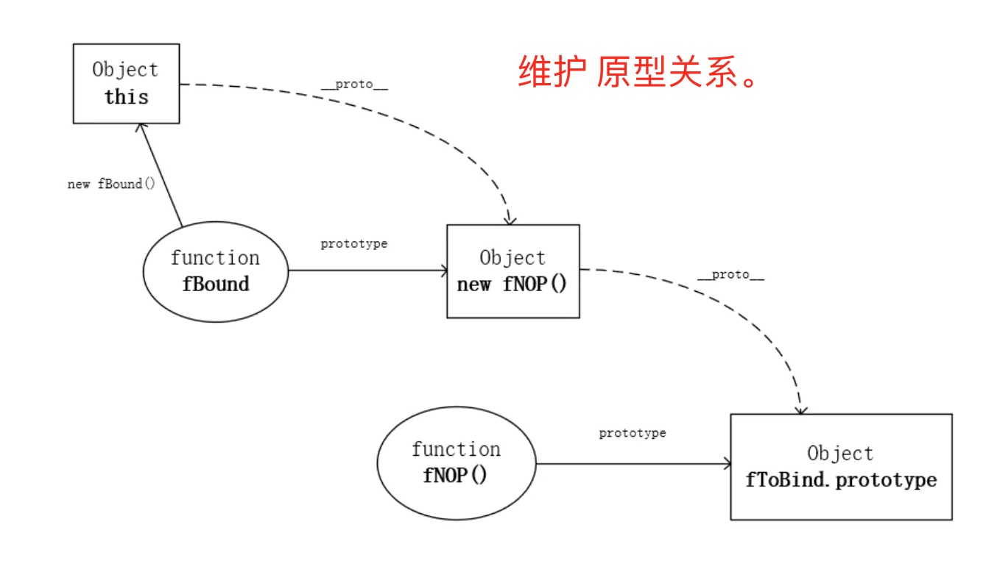

# 理解bind、call、apply

## 1. call、apply、bind使用和区别

这三个函数的存在作用是什么？为了改变函数执行时的上下文。


```
  let obj = {name: 'tony'};
  
  function Child(name){
    this.name = name;
  }
  
  Child.prototype = {
    constructor: Child,
    showName: function(){
      console.log(this.name);
    }
  }
  var child = new Child('thomas');
  child.showName(); // thomas
  
  //  call,apply,bind使用
  child.showName.call(obj);
  child.showName.apply(obj);

  let bind = child.showName.bind(obj); // 返回一个函数
  bind(); // tony

```

bind 与 call（apply）的区别：
1. bind 会返回改变了上下文后的一个函数。
2. call和apply改变后便执行该函数。 


call 与 apply的区别：
只是，参数的区别。

例子：

```
let arr1 = [1, 2, 19, 6];
//例子：求数组中的最值
Math.max(1,1,2,19,6);
Math.max.bind(null, 1,2,19,6)();
Math.max.call(null, 1,2,19,6); // 19
Math.max.call(null, arr1); // NaN
Math.max.apply(null, arr1); //  19 直接可以用arr1传递进去

```

## 2. 应用


### 将伪数组转化为数组


```
<!-- 1. fn内的arguments-->
function fn10() {
    return Array.prototype.slice.call(arguments);
}
fn10(1,2,3,4,5); // [1, 2, 3, 4, 5]

<!-- 2. 含有length属性的对象-->
let obj4 = {
	0: 1,
	1: 'thomas',
	2: 13,
	length: 3 // 一定要有length属性
};

Array.prototype.slice.call(obj4); // [1, "thomas", 13]


```


### 数组拼接，添加

```
let arr1 = [1,2,3];
let arr2 = [4,5,6];

//数组的concat方法：返回一个新的数组
let arr3 = arr1.concat(arr2); 
arr3; // [1, 2, 3, 4, 5, 6]

arr1; // [1, 2, 3] 不变
arr2; // [4, 5, 6] 不变
// 用 apply方法
[].push.apply(arr1,arr2);  // 给arr1添加arr2
arr1; // [1, 2, 3, 4, 5, 6]
arr2; // 不变

```

### 判断变量类型
Object.prototype.toString.call(value); // "[object xxx]"  
可以区分 null、string、boolean、number、undefined、array、function、object、date、math等  

```
<!-- toString 是最推荐的方式  -->

Object.prototype.toString.call(1); // "[object Number]"
// 日期类型
var date = new Date();
Object.prototype.toString.call(date); // "[object Date]"

<!-- ps: 直接执行不严谨，万一toString被重写了 -->
toString.call({}); // "[object Object]"

```

### 继承

```
function Animal(name){      
    this.name = name;      
    this.showName = function(){      
        console.log(this.name);      
    }      
}      

function Cat(name){    
    Animal.call(this, name);    
}

// Animal.call(this) 的意思就是使用this对象代替Animal对象，那么
// Cat中不就有Animal的所有属性和方法了吗，Cat对象就能够直接调用Animal的方法以及属性了
var cat = new Cat("TONY");     
cat.showName();   //TONY

```


## 3. 实现bind

```
Function.prototype.bind2 = function(context) {
    // 将this作保存,代表被绑定的函数
    var self = this;
    return function() {
        // 绑定函数可能会有返回值，所以这里要return一下
        return self.apply(context);
    }
}

```

```
function Foo(){
    console.log(this.a);
    this.a=1;
}
Foo.prototype.show=function() {console.log(this.a)};
Foo(); // undefined
var obj1=new Foo();
obj1.show();

var bar=Foo.bind2({a:2});
bar(); // 2
var obj2=new bar(); // this绑定中new操作具有最高的优先级，如果执行new操作，bind不起作用
obj2.show(); // TypeError: obj2.show is not a function

```
因为上面实现 bind2 函数内部没有维护原型关系的继承，所以对象obj2不能访问到原型上的show方法。

### 源码分析
下面是 MDN上提供的polyfill

```
if (!Function.prototype.bind) {
  Function.prototype.bind = function(oThis) {
    if (typeof this !== 'function') {
      throw new TypeError('Function.prototype.bind - what is trying to be bound is not callable')
    }
    var aArgs   = Array.prototype.slice.call(arguments, 1),
        fToBind = this,
        fNOP    = function() {},
        fBound  = function() {
          // 如果new，用新创建的this替换硬绑定的this
          return fToBind.apply(this instanceof fNOP 
                 ? this
                 : oThis,
                 aArgs.concat(Array.prototype.slice.call(arguments)))
        }
    // 维护原型关系
    if (this.prototype) {
        // Function.prototype doesn't have a prototype property
        fNOP.prototype = this.prototype; 
    }
    fBound.prototype = new fNOP()
    return fBound
  }
}

```





## 参考

[理解bind、call、apply](https://juejin.im/post/6844903567967387656)  
[bind函数polyfill源码解析](https://juejin.im/post/6844903639220224008)

ps:
```
instanceof (A,B) = {
    var L = A.__proto__;
    var R = B.prototype;
    if(L === R) {
        //A的内部属性__proto__指向B的原型对象
        return true;
    }
    return false;
}

```

例子 ===>>>

```
[] instanceof Object //true

function Person(){};
new Person() instanceof Person; // true
new Person instanceof Object; // true
```
