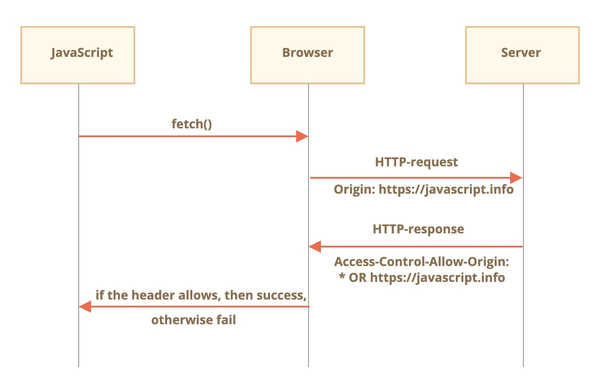
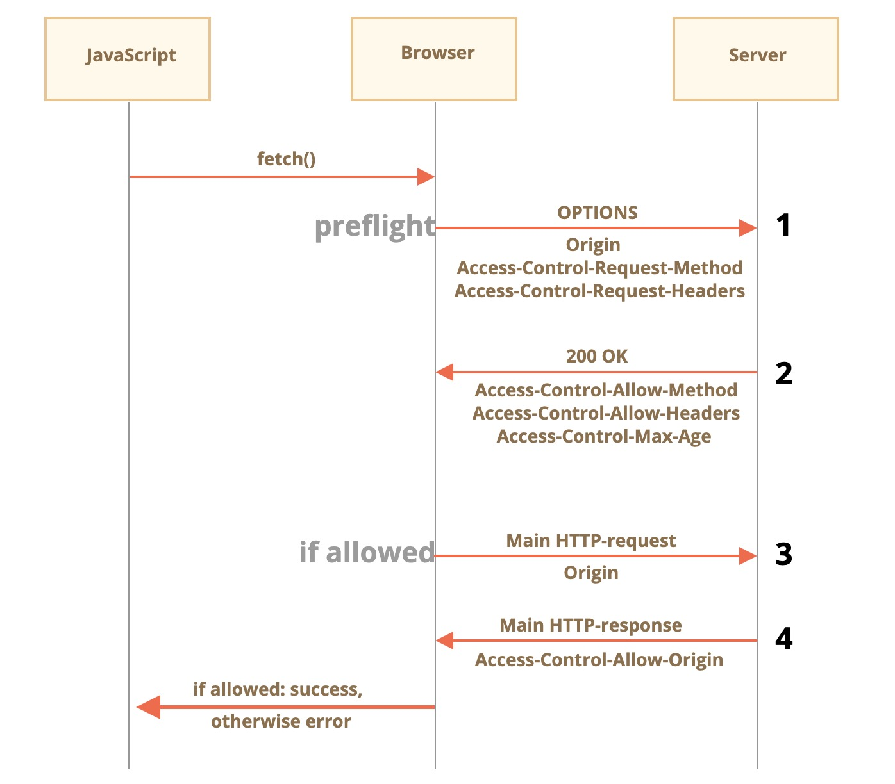

# cors跨域请求之简单请求和非简单请求

## 引言

浏览器发送跨域请求，如何判断？

浏览器在发送跨域请求的时候，会先判断下是简单请求还是非简单请求，如果是简单请求，就先执行服务端程序，然后浏览器才会判断是否跨域

栗子：在日常开发中，我们会发现同一个请求发送了两次，但是请求方式不同，这是因为CORS请求的简单请求和非简单请求的原因。

## 简单请求

顾名思义，简单的请求很简单，所以我们先从它开始。

一个 简单的请求 是指满足以下两个条件的请求：

简单的方法：GET，POST 或 HEAD
简单的 header —— 仅允许自定义下列 header：
* Accept，
* Accept-Language，
* Content-Language，
* Content-Type 的值为 application/* * x-www-form-urlencoded，multipart/form-data 或 text/plain。  

任何其他请求都被认为是“非简单请求”。例如，具有 PUT 方法或 API-Key HTTP-header 的请求就不是简单请求。

本质区别在于，可以使用 form 或 script 进行“简单请求”，而无需任何其他特殊方法。

因此，即使是非常旧的服务器也能很好地接收简单请求。

与此相反，带有非标准 header 或者例如 DELETE 方法的请求，无法通过这种方式创建。在很长一段时间里，JavaScript 都不能进行这样的请求。所以，旧的服务器可能会认为此类请求来自具有特权的来源（privileged source），“因为网页无法发送它们”。

当我们尝试发送一个非简单请求时，浏览器会发送一个特殊的“预检（preflight）”请求到服务器 —— 询问服务器，你接受此类跨源请求吗？

并且，除非服务器明确通过 header 进行确认，否则非简单请求不会被发送。

现在，我们来详细介绍它们。

### 用于简单请求的 CORS
如果一个请求是跨源的，浏览器始终会向其添加 Origin header。

例如，如果我们从 https://javascript.info/page 请求 https://anywhere.com/request，请求的 header 将会如下：
```
GET /request
Host: anywhere.com
Origin: https://javascript.info
...
```

Origin 包含了确切的源（domain/protocol/port），没有路径。

服务器可以检查 Origin，如果同意接受这样的请求，就会在响应中添加一个特殊的 header Access-Control-Allow-Origin。该 header 包含了允许的源（在我们的示例中是 https://javascript.info），或者一个星号 *。然后响应成功，否则报错。

浏览器在这里扮演受被信任的中间人的角色：

它确保发送的跨源请求带有正确的 Origin。
它检查响应中的许可 Access-Control-Allow-Origin，如果存在，则允许 JavaScript 访问响应，否则将失败并报错。
 

这是一个带有服务器许可的响应示例：
```
200 OK
Content-Type:text/html; charset=UTF-8
Access-Control-Allow-Origin: https://javascript.info
```

### Response header
对于跨源请求，默认情况下，JavaScript 只能访问“简单” response header：

* Cache-Control
* Content-Language
* Content-Type
* Expires
* Last-Modified
* Pragma

访问任何其他 response header 都将导致 error。

要授予 JavaScript 对任何其他 response header 的访问权限，服务器必须发送 Access-Control-Expose-Headers header。它包含一个以逗号分隔的应该被设置为可访问的非简单 header 名称列表。

例如：
```
200 OK
Content-Type:text/html; charset=UTF-8
Content-Length: 12345
API-Key: 2c9de507f2c54aa1
Access-Control-Allow-Origin: https://javascript.info
Access-Control-Expose-Headers: Content-Length,API-Key
```
有了这种 Access-Control-Expose-Headers header，此脚本就被允许读取响应的 Content-Length 和 API-Key header。


## “非简单”请求

我们可以使用任何 HTTP 方法：不仅仅是 GET/POST，也可以是 PATCH，DELETE 及其他。

之前，没有人能够设想网页能发出这样的请求。因此，可能仍然存在有些 Web 服务将非标准方法视为一个信号：“这不是浏览器”。它们可以在检查访问权限时将其考虑在内。

因此，为了避免误解，任何“非标准”请求 —— 浏览器不会立即发出在过去无法完成的这类请求。即在它发送这类请求前，会先发送“预检（preflight）”请求来请求许可。

预检请求使用 OPTIONS 方法，它没有 body，但是有两个 header：

* Access-Control-Request-Method header 带有非简单请求的方法。
* Access-Control-Request-Headers header 提供一个以逗号分隔的非简单 HTTP-header 列表。

如果服务器同意处理请求，那么它会进行响应，此响应的状态码应该为 200，没有 body，具有 header：

* Access-Control-Allow-Origin 必须为 * 或进行请求的源（例如 https://javascript.info）才能允许此请求。
* Access-Control-Allow-Methods 必须具有允许的方法。
* Access-Control-Allow-Headers 必须具有一个允许的 header 列表。
* 另外，header Access-Control-Max-Age 可以指定缓存此权限的秒数。因此，浏览器不是必须为满足给定权限的后续请求发送预检。

 
举个栗子：
```js
let response = await fetch('https://site.com/service.json', {
  method: 'PATCH',
  headers: {
    'Content-Type': 'application/json',
    'API-Key': 'secret'
  }
});
```
这里有三个理由解释为什么它不是一个简单请求：

1. 方法 PATCH
2. Content-Type 不是这三个中之一：application/x-www-form-urlencoded，multipart/form-data，text/plain。
3. “非简单” API-Key header。

### Step 1 预检请求（preflight request）
在发送我们的请求前，浏览器会自己发送如下所示的预检请求：
```
OPTIONS /service.json
Host: site.com
Origin: https://javascript.info
Access-Control-Request-Method: PATCH
Access-Control-Request-Headers: Content-Type,API-Key
```
* 方法：OPTIONS。
* 路径 —— 与主请求完全相同：/service.json。
* 特殊跨源头：
Origin —— 来源。

Access-Control-Request-Method —— 请求方法。

Access-Control-Request-Headers —— 以逗号分隔的“非简单” header 列表。

### Step 2 预检响应（preflight response）

服务应响应状态 200 和 header：

* Access-Control-Allow-Origin: https://javascript.info
* Access-Control-Allow-Methods: PATCH
* Access-Control-Allow-Headers: Content-Type,API-Key。

这将允许后续通信，否则会触发错误。

如果服务器将来期望其他方法和 header，则可以通过将这些方法和 header 添加到列表中来预先允许它们。

例如，此响应还允许 PUT、DELETE 以及其他 header：
```
200 OK
Access-Control-Allow-Origin: https://javascript.info
Access-Control-Allow-Methods: PUT,PATCH,DELETE
Access-Control-Allow-Headers: API-Key,Content-Type,If-Modified-Since,Cache-Control
Access-Control-Max-Age: 86400
```
现在，浏览器可以看到 PATCH 在 Access-Control-Allow-Methods 中，Content-Type,API-Key 在列表 Access-Control-Allow-Headers 中，因此它将发送主请求。

如果 Access-Control-Max-Age 带有一个表示秒的数字，则在给定的时间内，预检权限会被缓存。上面的响应将被缓存 86400 秒，也就是一天。在此时间范围内，后续请求将不会触发预检。假设它们符合缓存的配额，则将直接发送它们。

### Step 3 实际请求（actual request）
预检成功后，浏览器现在发出主请求。这里的算法与简单请求的算法相同。

主请求具有 Origin header（因为它是跨源的）：
```
PATCH /service.json
Host: site.com
Content-Type: application/json
API-Key: secret
Origin: https://javascript.info
```

### Step 4 实际响应（actual response）

服务器不应该忘记在主响应中添加 Access-Control-Allow-Origin。成功的预检并不能免除此要求：
```
Access-Control-Allow-Origin: https://javascript.info
```
然后，JavaScript 可以读取主服务器响应了。

请注意：  
预检请求发生在“幕后”，它对 JavaScript 不可见。

JavaScript 仅获取对主请求的响应，如果没有服务器许可，则获得一个 error。

## 凭据（Credentials）
默认情况下，由 JavaScript 代码发起的跨源请求不会带来任何凭据（cookies 或者 HTTP 认证（HTTP authentication））。

这对于 HTTP 请求来说并不常见。通常，对 http://site.com 的请求附带有该域的所有 cookie。但是由 JavaScript 方法发出的跨源请求是个例外。

例如，fetch('http://another.com') 不会发送任何 cookie，即使那些 (!) 属于 another.com 域的 cookie。

为什么？

这是因为具有凭据的请求比没有凭据的请求要强大得多。如果被允许，它会使用它们的凭据授予 JavaScript 代表用户行为和访问敏感信息的全部权力。

服务器真的这么信任这种脚本吗？是的，它必须显式地带有允许请求的凭据和附加 header。

要在 fetch 中发送凭据，我们需要添加 credentials: "include" 选项，像这样：
```js
fetch('http://another.com', {
  credentials: "include"
});
```
现在，fetch 将把源自 another.com 的 cookie 和我们的请求发送到该网站。

如果服务器同意接受 带有凭据 的请求，则除了 Access-Control-Allow-Origin 外，服务器还应该在响应中添加 header Access-Control-Allow-Credentials: true。

例如：
```
200 OK
Access-Control-Allow-Origin: https://javascript.info
Access-Control-Allow-Credentials: true
```
请注意：对于具有凭据的请求，禁止 Access-Control-Allow-Origin 使用星号 *。如上所示，它必须有一个确切的源。这是另一项安全措施，以确保服务器真的知道它信任的发出此请求的是谁。