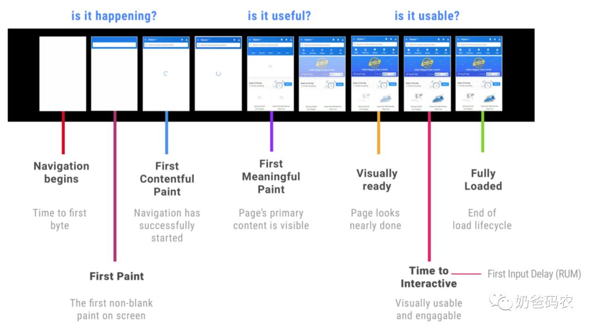
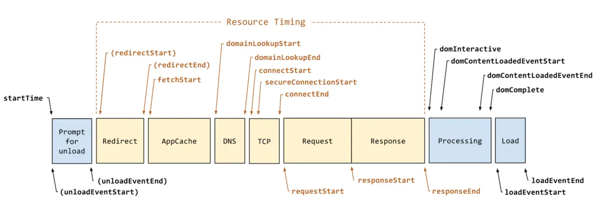

# 页面性能指标-performance

75%的人是认为页面加载时长是一个核心因素，远远高于其他影响用户体验的问题，例如：简洁易用、屏幕适配、设计吸引力等等。


性能对于业务而言，也会直接影响到用户留存、页面转化和用户体验等等方面。 

业界有许多性能直接影响业务的例子：

1. Pinterest减少页面加载时长40%, 提高了搜索和注册数15%
2. BBC页面加载时长每增加1秒，用户流失10%
3. DoubleClick发现如果移动网站加载时长超过3秒，53%的用户会放弃


## 重要事件：DOMContentLoaded 和 onload

DOMContentLoaded: 浏览器已完全加载 HTML，并构建了 DOM 树，但像  和样式表之类的外部资源可能尚未加载完成。
onload: 整个页面，包括样式、图片和其他资源被加载完成时。onerror（出现错误）

Q: 问题来了，执行 `DOMContentLoaded` 的时候，js脚本执行了吗？  
A: `不一定`，onload事件之后肯定解析好了。   
defer（4）和async（5）加载都不阻塞页面渲染，有onload事件。  

不同点：
defer 页面解析完成，执行。之后 DOMContentLoaded事件。  
async `异步的加载和执行脚本`；js一旦下载好了就会执行，注意：如果js前后有依赖性，就很有可能出错。之后，onload事件。

async应用：独立的第三方脚本集成到页面时，此时采用异步加载方式是非常棒的：计数器，广告等。


## 常见web性能指标- Chrome
DOMContentLoaded 或 Load 这样的度量并不能反映用户的视觉体验，因为它们的时间点不一定与用户在屏幕上看到内容的时间点对应。
First Paint 和 First Contentful Paint 这些以用户为中心的性能指标关注的是初始绘制时间，可以用来衡量页面的`白屏时间`。

|FP|FCP|LCP|DCL|L|  
| :-----| :---- | :---- | :---- | :---- |
|First Paint|First Contentful Paint|Largest Contentful Paint|DomContentLoaded|Load|
|首次绘制像素|浏览器首次绘制来自 DOM 的内容|可视区域中最大的内容元素呈现到屏幕上的时间|dom构建完成|onLoad 事件触发的时间|

## 真正衡量web性能的指标及计算
首屏时间 First Screen Paint（FSP）  

页面从开始加载到首屏内容全部绘制完成的时间，用户可以看到首屏的全部内容。

没有具体的计算方法，以onload？Load时间太长，用户都可以交互了。

3个核心指标：FP、FSP、TTI

```
一些核心时间可以通过以下时间点进行计算：(performance.timing)

DNS查询：domainLookupEnd - domainLookupStart（keeper-0ms）
TCP连接：connectEnd - connectStart(0）

FP首次渲染：domLoading - navigationStart (白屏时间-97)
FSP：可视区域内完整的内容 (暂时没有标准)
TTI：可流畅交互时间：domInteractive - navigationStart  (338)
DOMReady：domContentLoadedEventEnd - navigationStart （439）
onload：loadEventEnd - navigationStart（446）

解释：
navigationStart 加载起始时间

```
🌰例子
```
<!DOCTYPE html>
<html>
  <head>
    <title>Critical Path: Measure</title>
    <meta name="viewport" content="width=device-width,initial-scale=1">
    <link href="style.css" rel="stylesheet">
    <script>
      function measureCRP() {
        var t = window.performance.timing,
          interactive = t.domInteractive - t.domLoading,
          dcl = t.domContentLoadedEventStart - t.domLoading,
          complete = t.domComplete - t.domLoading;
        var stats = document.createElement('p');
        stats.textContent = 'interactive: ' + interactive + 'ms, ' +
            'dcl: ' + dcl + 'ms, complete: ' + complete + 'ms';
        document.body.appendChild(stats);
      }
    </script>
  </head>
  <body onload="measureCRP()">
    <p>Hello <span>web performance</span> students!</p>
    <div></div>
  </body>
</html>
```

## 附

Frames Per Second（FPS）

`帧率`是视频设备产生图像（或帧）的速率，用每秒可以重新绘制的帧数（Frames Per Second，FPS）表示。
重新绘制可能需要重新计算样式、布局和绘制，如果每帧绘制到屏幕的时间在 16.7 ms 以上，每秒绘制的帧数就会小于 60 帧，人眼就能感受到页面出现卡顿，所以 FPS 是衡量应用流畅度的一个非常重要的指标，60fps 是页面流畅的目标，可以为每次绘制提供 16.7ms 的时间预算。

## 参考
https://my.oschina.net/u/3247020/blog/4361819  
https://juejin.cn/post/6844904153869713416#heading-6  
https://developers.google.com/web/fundamentals/performance/critical-rendering-path/measure-crp?hl=zh-cn   


