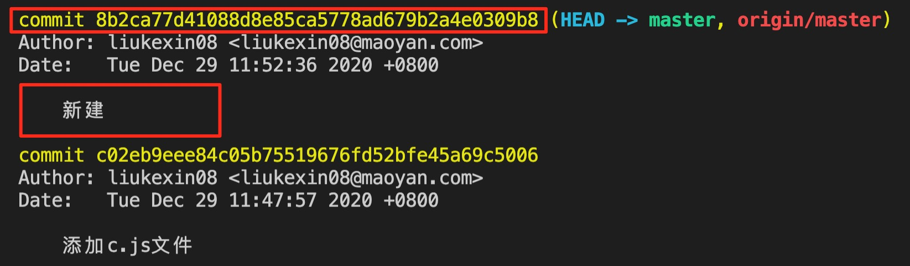
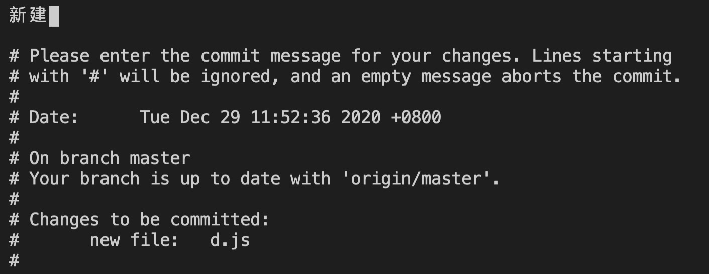
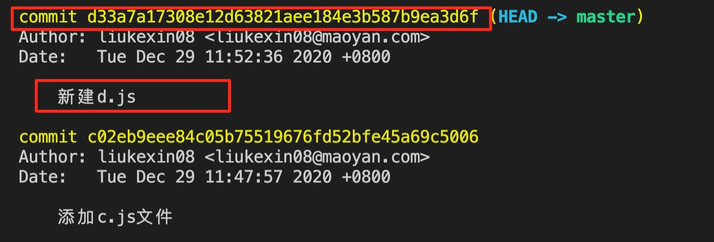
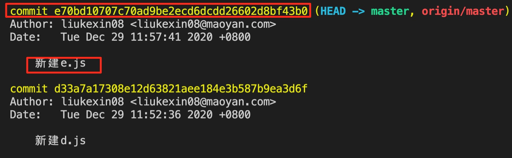
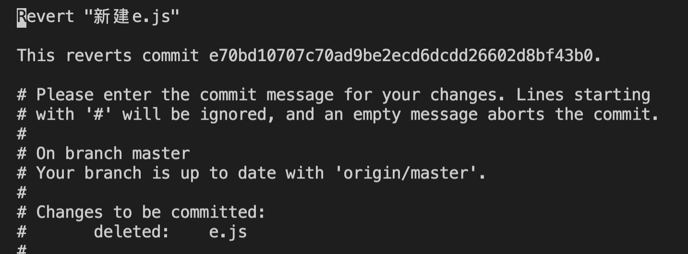
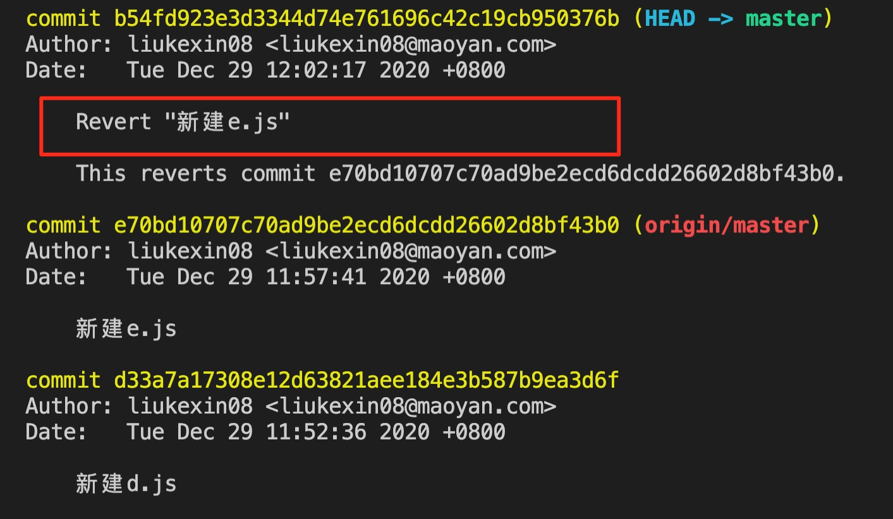
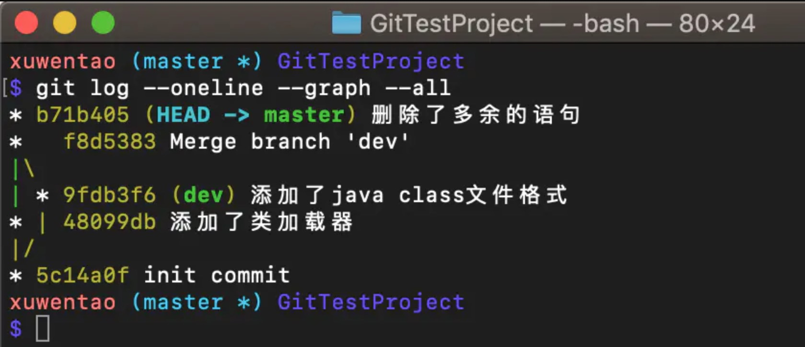
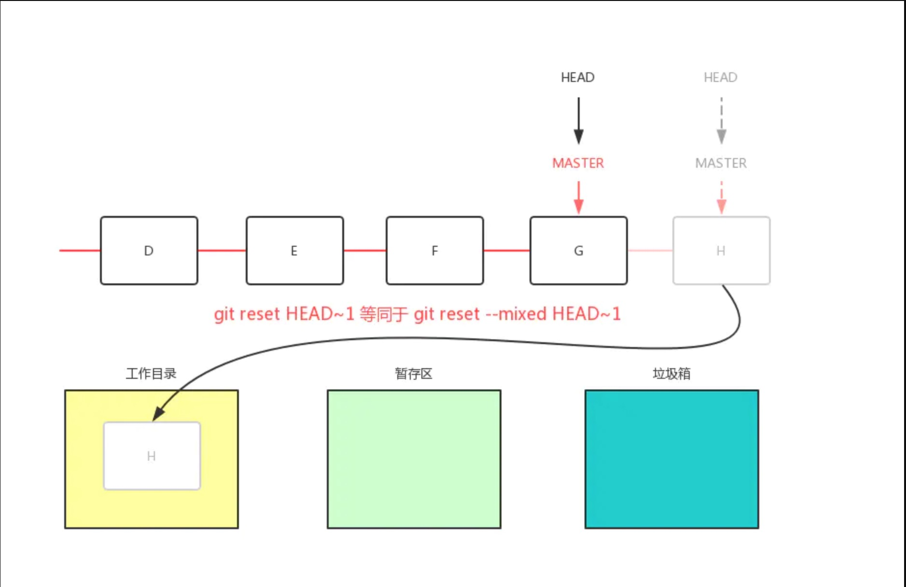
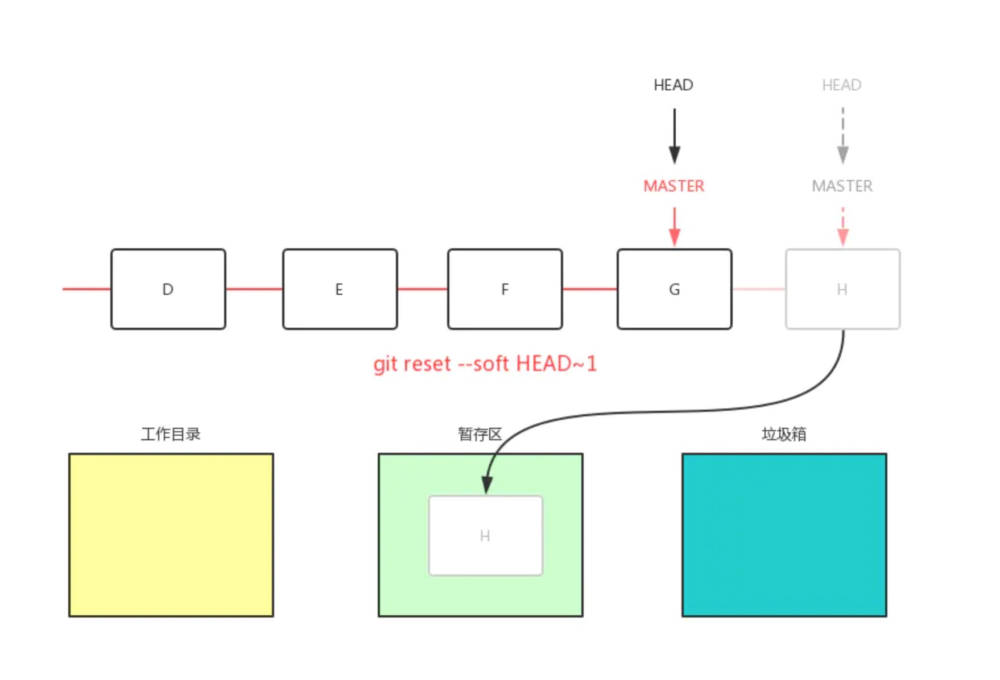
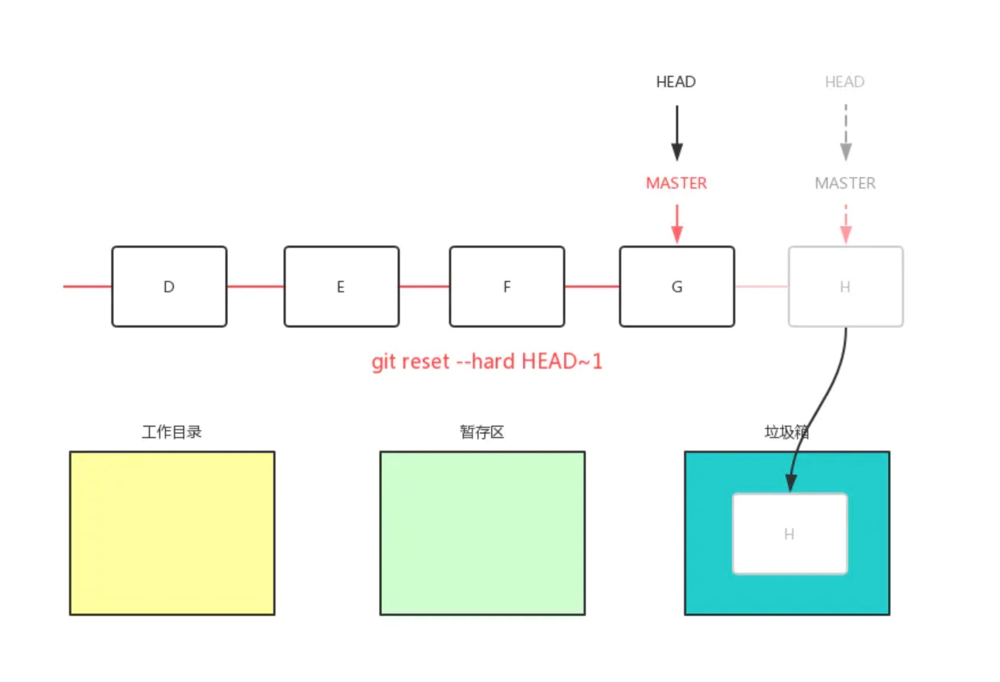

# git撤销更改

## 引言
撤销更改涉及到三个命令：
* git commit --amend ：可以修改最后一次提交中的内容，加东西，加文件。修改 commit 信息。
* git revert ：可以撤销对应的 commit ，并产生一个新的 commit 。
* git reset ：可以清除最近的 commit 。并不能任意删除，需要按照顺序。

## git commit --amend
在平时的项目开发中，有时候我们可能提交完相应文件后，才发现漏掉了几个文件没有添加，或者我们 commit 消息并没有书写完整或有错别字。

或许我们会执行一个新的提交来添加我们遗漏的内容，但是这样一点都不优雅！！在Git中为我们提供了带有 --amend 选项的提交来修改我们最近的提交:
```
git commit --amend
```
🌰：
 

在上述例仓库中我们创建了一个 commit ，该 commit 消息并没有书写完整。这个时候我们想修改它，那么我们就可以使用命令 git commit --amend ，当输入该命令后，我们能得到如下弹窗:
 

这个时候，我们就可以完善该 commit 信息，然后保存并离开。我们再使用 git log 命令，我们会发现我们的 commit 消息已经被更改了
 

当然在上述例子中，我们只是简单的修改了 commit 信息，并没有修改或添加一些新的文件，如果你修改或添加了新的文件，并想将这些修改的文件添加到最近的 commit 中去的话，那么你可能要经历以下步骤：

编辑文件
保存文件
暂存文件 (git add)
运行 git commit --amend

在实际的项目中，如果你想修改最近的 commit ，那么你需要使用 git commit --amend 来更新最近的 commit ，而不是创建新的 commit 。


所有的commit信息都修改完之后运行一下命令将更改推送到远程：
```
git push origin master --force
```

## git revert
在上述例子中，我们知道了如何修改最近的 commit ，但是如果我们想还原这个 commit 。那这个时候，我们又该怎么办呢？我们可以使用 git revert 命令来告诉 Git 还原之前创建的commit，该命令使用的方式如下：

当你告诉 Git 还原（revert） 具体的 commit 时，git 会执行和 commit 中的更改完全相反的更改。假设 commit A 添加了一个字符，如果 Git 还原 commit A，那么 Git 将创建一个 新的 commit ，并删掉该字符。如果删掉了一个字符，那么还原该 commit 将把该内容添加回来！

```
git revert <SHA-of-commit-to-revert>
```
🌰：
 

使用 git revert b71b40 ，需要注意的是使用该命令，默认会创建一个新的提交
这里 b71b40 是对应 commit 的 SHA 的前七个字符，当然你也可以使用完整的 SHA 。
 

一般情况下，我们可以使用Git系统默认的 revert 信息。当我们保存并退出后，再使用 git log 命令查看我们的日志提交记录，我们能得到下图：
 

之后运行一下命令将更改推送到远程：
```
git push origin master --force
```

### 撤销merge
在描述 merge commit 之前，先来简短地描述一下常规的 commit。每当你做了一批操作（增加、修改、或删除）之后，你执行 git commit 便会得到一个常规的 Commit。执行 git show <commit> 将会输出详细的增删情况。

Merge commit 则不是这样。每当你使用 git merge 合并两个分支，你将会得到一个新的 merge commit。执行git show <commit>之后，会有类似的输出：
```js
commit e84e22d6241322e8b6b78353936d3c0783859bfc (HEAD -> master, origin/master, origin/HEAD)
Merge: 464c2a4 0a26c15
Author: liukexin08 <liukexin08@maoyan.com>
Date:   Mon Jan 4 11:31:26 2021 +0800

    Merge pull request #43 in ~CAIYI04/v-editor from feature/lkx to master
    
    * commit '0a26c1588239e44b10ce89d59f0c713026ed8da3':
:
```
其中，Merge 这一行代表的是这个合并 parents，它可以用来表明 merge 操作的线索。例如：dev分支代码合并到master，则464c2a4代表master分支未合并的commit，0a26c15代码dev分支要合并的commit
```
a -> b -> c -> f -- g -> h (master)
\ /
d -> e (dev)
```
当你使用 git revert 撤销一个 merge commit 时，如果除了 commit 号而不加任何其他参数，git 将会提示错误：
```js
$ git revert g
error: Commit g is a merge but no -m option was given.
fatal: revert failed
```
在你合并两个分支并试图撤销时，Git 并不知道你到底需要保留哪一个分支上所做的修改。从 Git 的角度来看，master 分支和 dev 在地位上是完全平等的，只是在 workflow 中，master 被人为约定成了「主分支」。

于是 Git 需要你通过 m 或 mainline 参数来指定「主线」。merge commit 的 parents 一定是在两个不同的线索上，因此可以通过 parent 来表示「主线」。m 参数的值可以是 1 或者 2，对应着 parent 在 merge commit 信息中的顺序。

git revert -m 1 g 将会保留 master 分支上的修改，撤销 dev 分支上的修改。撤销成功之后，Git 将会生成一个新的 Commit，提交历史就成了这样：
```
a -> b -> c -> f -- g -> h -> G (master)
\ /
d -> e (dev)
```
其中 G 是撤销 g 生成的 commit。通过 $ git show G 之后，我们会发现 G 是一个常规提交，内容就是撤销 merge 时被丢弃的那条线索的所有 commit 的「反操作」的合集。

## git reset
### git reset 简介
在上述例子中，我们学会了如何还原一个提交，但是如果我们本是这个提交就是错误的，我们并不想要这个提交，也不想仓库记录中包含 revert 的提交记录。这个时候我们又该怎么办呢？我们可以使用 git reset 命令来告诉 Git 重置 commit 。
重置（reset） 似乎和 还原（revert） 相似，但它们实际上差别很大。还原会创建一个新的 commit，并还原或撤消之前的 commit。但是重置会清除 commit！

```
git reset 命令是少数几个可以从仓库中清除 commit 的命令，如果某个 commit 不再存在与仓库中，它所包含的内容也会消失。不过不用担心，Git 会在完全清除任何内容之前，持续跟踪提交记录大约30天，我们可以通过 git reflog 来查看仓库中所有的改变。
```

### git reset 命令的使用
git reset 命令相比其他 Git 命令功能要多一点，可以用来：

* 将 HEAD 和当前分支指针移到目标 commit。
* 清除 commit 。
* 将 commit 的更改移动到暂存区中。
* 取消暂存 commit 的更改。


git reset 并不直接使用 commit 的 SHA(版本号) ，而是使用特殊的 "祖先引用" 来告诉 Git 将 HEAD 指针移动到哪个commit。我们来看看这些特殊的符号。
* ^ ： 表示父 commit
* ~ ： 表示第一个父 commit

我们可以通过以下方式引用之前的 commit：

当前 commit 的父 commit
```
HEAD^
HEAD~
HEAD~1
```
当前 commit 的祖父 commit
```
HEAD^^
HEAD~2
```
当前 commit 的曾祖父 commit
```
HEAD^^^
HEAD~3
```

^ 和 ~ 的区别主要体现在通过合并而创建的 commit 中。合并 commit 具有两个父级。对于合并 commit，^ 引用用来表示第一个父 commit，而 ^2 表示第二个父 commit。第一个父 commit 是当你运行 git merge 时所处的分支，而第二个父 commit 是被合并的分支。

🌰：
可以使用 git log --oneline --graph --all 来查看所有的分支信息。

 

因为 HEAD 指向 b71b405 commmit。

那么 f8d5383 commit 我们可以这样表示：

* HEAD^
* HEAD~1

那么 9fdb3f6 commit 我们可以这样表示：

* HEAD^^2（ ^2 表示合并分支上的父提交）


那么 48099db commit 我们可以这样表示：

* HEAD^^
* HEAD~2

了解了祖先引用，现在我们来了解 git reset 命令的使用：
```
git reset <reference-to-commit>
```
一般情况下，使用该命令，我们会添加如下选项：

* --mixed (默认不指定任何选项)移动到工作目录，不会暂存我们的文件，工作内容与原来相同，但是SHA不同，因为时间戳不同。
* --soft 移动到暂存区，这些改动仍然存在，而且已经暂存好了。
* --hard 会删除对应所有的提交的内容。


#### --mixed 例子
在下图中，假如我们的仓库中已经有了如下提交 D、E、F、G、H，其中 master 指向最近的提交 H，HEAD 指向 master。

这个时候我们如果使用 git reset --mixed HEAD~1 那么会将 master 与 HEAD 将会指向前一个提交 G。同时 G 提交会移动到工作目录中。如下图所示：

```
注意，git reset --mixed HEAD~1 等同于 git reset --mixed HEAD^ ，也等同于 git reset HEAD~1 (git reset 命令默认选项为 --mixed)。
```

 

当 H 提交修改的文件被移动到到工作目录后，文件的状态都为 modifed，也就是我们需要重新添加到暂存区，然后进行 commit 。

调用 git status 来查看我们的仓库状态，我们会发现使用 --mixed 选项，是不会暂存我们的更改的，也就是不会将相应提交的文件放入暂存区中。

#### --soft 例子
当使用 --soft 选项时，不仅会移动 master 与 HEAD 指针，还会将相应修改添加到暂存区中，如下所示：
 


#### --hard 例子
 

使用 --hard 将清除对应 commit 所作的更改


#### 取消暂存区中的内容
当我们直接使用 git reset 或 git reset HEAD时，表示清除暂存区中的 commit 。

当然在Git中支持多个或单个文件的取消暂存
```
git reset HEAD <file>...
```

## 参考链接
https://git-scm.com/docs/git-reset