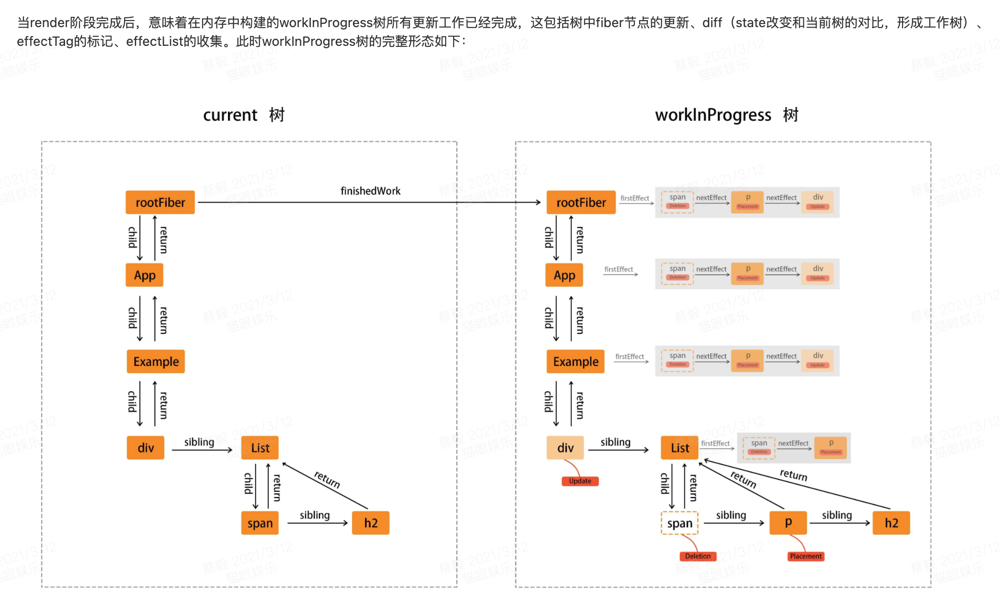
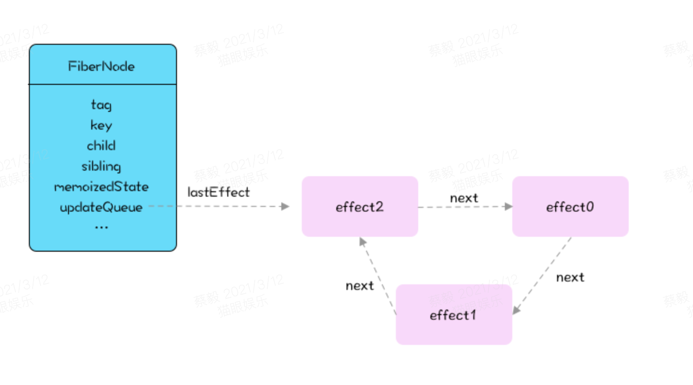

# react源码分享之commit

## 开场

render之后就是commit。

```
import * as React from 'react';
import * as ReactDOM from 'react-dom';
import App from './App';

ReactDOM.render(
  <React.StrictMode>
    <App />
  </React.StrictMode>,
  document.getElementById('root')
);
```

```
import * as React from 'react';

export default function App(){
  let [number, setNumber] = React.useState(0);

  React.useEffect(() =>{
    setNumber(8);
  }, []);

  return (
    <div className="App">
      <button onClick={add}>{number}</button>
    </div>
  );
}
```

打个不恰当的比喻：本地代码改完了，我们要执行`git add ` 和`git commit ` 把代码提交上去。
在这里`commit`对应的就是真实的dom的更新。

## 引入问题

我们应该知道 useEffect 传入 [] 作为第二个参数有点类似于 componentDidMount。

那来看一个 `bad case`。

```
const Child = ({ getFormIns }) => {
  // 生成一个 form 实例
  const form = Form.useForm();
    
  // 试图向外层传递 form 实例
  useEffect(() => {
    if(getFormIns) {
      getFormIns(form);
    }
  }, [])；
    
  return <span></span>
}
  
class App extends React.Component {
  constructor(props) {
    super(props);
		this.formIns = null;
  }
    
  componentDidMount() {
    // 拿到 form 实例 做一些操作
    formIns.updateModel({});
  }
    
  return <Child getFormIns={(form) => this.formIns = form} />
}
```
以上代码中试图在父组件中调用 Form 实例相关的方法， 但是实际上 useEffect 的执行时机并不是真正的 didMount，导致父组件在 DidMount 的时候出错，将 useEffect 换成 useLayoutEffect 就可以解决上述问题，但不管是使用 useLayoutEffect 还是使用 useEffect 都不符合 Hooks 的语义，在示例代码中场景是父组件期望可以调用子组件的变量或者方法，这种场景更适合使用 useImperativeHandle 来代替。 

这个问题我们需要弄懂 commit的过程：


下面看看源码流程：
## 源码

```
//提交HostComponent的 side effect，也就是 DOM 节点的操作(增删改)
 
function commitRoot(root) {
  //获取调度优先级，并临时替换当前的优先级，去执行传进来的 callback  ImmediatePriority
  const renderPriorityLevel = getCurrentPriorityLevel();
  runWithPriority(
    ImmediateSchedulerPriority,
    commitRootImpl.bind(null, root, renderPriorityLevel),
  );
  return null;
}
 
function commitRootImpl() {
  // 刷新所有的 PassiveEffect
  do {
    flushPassiveEffects();
  } while (rootWithPendingPassiveEffects !== null);
   
  // Get the list of effects.
  // effectList 的第一个节点
  let firstEffect;
  // ...
  // 省略 if 判断，如果 root 有副作用的话，其副作用将会放置在 effectList 的末尾，root 无副作用的话，那么 firstEffect 就是根组件的 firstEffect
  firstEffect = finishedWork.firstEffect;
  if (firseEffect !== null) {
    nextEffect = firstEffect;
    // 第一阶段，before mutation
    do {
      commitBeforeMutationEffects();
    } while(nextEffect !== null)

    // ...
    // 将游标重置，指向 effect list 头
    nextEffect = firstEffect;
    // 第二阶段 mutation
    do {
      commitMutationEffects(root, renderPriorityLevel);
    } while(nextEffect !== null)
         
    //重要：将当前的 workInProgress树 作为 current 树
    root.current = finishedWork;
     
    // ...
    // 第三阶段 layout
    do {
      commitLayoutEffects(root, expirationTime);
    } while(nextEffect）
             
    // 让调度器在 帧 的末尾暂停，给浏览器机会执行一次 重绘
    requestPaint();
     
    // 本次 commit 是否有产生新的更新
    if (rootDoesHavePassiveEffects) {
    // 如果存在新的更新，将 root 节点赋给 rootWithPendingPassiveEffects
    rootWithPendingPassiveEffects = root;
    ...
    } else {
      // 遍历 effect list 逐个设置为 null 以便 GC
      nextEffect = firstEffect;
      while (nextEffect !== null) {
        const nextNextEffect = nextEffect.nextEffect;
        nextEffect.nextEffect = null;
        if (nextEffect.effectTag & Deletion) {
          detachFiberAfterEffects(nextEffect);
        }
        nextEffect = nextNextEffect;
      }
    }
     
    // 确保 root 上所有的 work 都被调度完
    ensureRootIsScheduled(root);
     
    // 检测在 useLayoutEffect 中是否做了布局修改等，刷新布局，如果在 layoutEffect 中调用了 setState 也会在该函数中检测中并开启新的一轮调度
    // 原版注释： If layout work was scheduled, flush it now.
    flushSyncCallbackQueue();
  } else { ... }
}

```

## 总结
一个完整的 commit 会被拆分为三个子阶段来完成，在 commit 末尾会刷新 commit 阶段产生的同步回调及 setState  
    第一阶段：对于 Class 组件而言，是执行 getSnapShotBeforeUpdate 生命周期，对于函数式组件则是安排异步回调  
    第二阶段：React 会挂载或更新 DOM，并清理上一轮的 useLayoutEffect  
    第三阶段：对于 Class 组件而言是执行 componentDidMount，对于函数式组件则是执行 useLayoutEffect  

## QA

### 0. useEffect 和 useLayoutEffect
顺序函数式调用：从上到下，父useState>子useState>子useLayoutEffect>父useLayoutEffect>子useEffect>父useEffect  

    a. 首先推荐使用useEffect，建议带依赖的第二个参数。  
    b. useLayoutEffect 是更加类似 componentDidmount，可以使用它来读取 DOM 布局并同步触发重渲染。在浏览器执行绘制之前，useLayoutEffect 内部的更新计划将被同步刷新。 
    c.useEffect 与 componentDidMount、componentDidUpdate 不同的是，在浏览器完成布局与绘制之后，传给 useEffect 的函数会延迟调用。这使得它适用于许多常见的副作用场景，比如设置订阅和事件处理等情况，因此不应在函数中执行阻塞浏览器更新屏幕的操作。

未来：从概念上来说它表现为：所有 effect 函数中引用的值都应该出现在依赖项数组中。未来编译器会更加智能，届时自动创建数组将成为可能。

### 1. Hook 在组件顶层调用
[在组件顶层调用 Hook 的原因](https://react.html.cn/docs/hooks-rules.html#explanation)  
我们可以在单个组件中使用多个 State 或 Effect Hook：  
那么 React 如何知道哪个 state(状态) 对应于哪个 useState 调用呢？答案是 React 依赖于调用 Hooks 的顺序。  

```
  // 🔴 我们在条件语句中使用Hook，打破了第一条规则
  if (name !== '') {
    useEffect(function persistForm() {
      localStorage.setItem('formData', name);
    });
  }
```

同样的：
只在 React Functions 调用 Hooks。


### 2. 错误边界？ componentDidCatch
三个阶段都有错误处理。

### 3. fiber Dom挂载？
发生在第二阶段。

### 4. root.current = finishedWork; 是什么意思？
重要：在 DomElement 副作用处理完毕之后，意味着之前讲的缓冲树（workInProgress）已经完成任务，翻身当主人，成为下次修改过程的current 树。

### 5. requestPaint()是干什么的 ？
让调度器在 帧 的末尾暂停，给浏览器机会执行一次 重绘。
绘制图形、svg等。

### 6. firstEffect 和 flushPassiveEffects（flush） 是啥意思?

finishedWork.firstEffect.nextEffect 形成effect链？

flushPassiveEffects 清空副作用。

### 7. expirationTime 和 lanes 区别
[新的时间模型lanes](https://github.com/suoutsky/three-body-problem/issues/124)
[react lanes 和 expirationTime-知乎](https://zhuanlan.zhihu.com/p/158779371)
[使用 lanes 模型替代 expirationTime 模型](https://juejin.cn/post/6898635086657224717#heading-12)

在 V6 版本中，以expirationTime的大小来衡量优先级，expirationTime越大，则优先级越高。 
expirationTime 问题：只能执行一个任务。
lanes：可以同时执行多个任务的能力。 // 值越大，优先级越高
这种优先级区间模型被称为lanes（车道模型）。

本质是【叠加算法】，多个任务可以相互叠加表示，用 js 来表示就是一个状态队列 { lanes: [1, 2, 3] }
表示 fiber 有三个不同的优先级，他们应该被批处理

react 作者 acdlite 觉得操作状态队列不够方便，进而采用了一种“位运算代替状态队列”的方式：{ lanes: 0b10010 }
新的 lane 算法中，lanes 是一个二进制数字，比如 10010 是由 10000 和 00010 两个任务叠加而成的。

### 8. 钩子里面初始化定时器问题。
期待后面钩子的分享：
如何解决 https://overreacted.io/zh-hans/making-setinterval-declarative-with-react-hooks/


## 组内分享 wiki
下面这部分是在组内进行的react源码分享，格式没怎么整理。
### 目录
大纲及参考
带着问题看源码
概览（思想）
开始
useEffect 和 useLayoutEffect区别？
大概的源码（v17）
QA：
1、React中dom真实的更新在什么时候？
2、useLayoutEffect和useEffect的执行时机？
3、effectList 是什么样子的？
updateQueue？
4、错误边界？react如何处理错误
总结：
大纲及参考


我的分享： commit-提交更新


之前分享

2021Q1 react源码

React 核心架构

setState && forceUpdate


分享期望：

不翻车

流程+ debug跑一下

从问题出发


参考：

[比官网hook讲的好](https://mp.weixin.qq.com/s/CLoBLocPvuvWaeseDQHYGA)

[hook源码-知乎](https://zhuanlan.zhihu.com/p/68842478)

[React17源码分析-图解](https://juejin.cn/post/6898635086657224717#heading-0)


[烤透 React Hook](https://juejin.cn/post/6867745889184972814#heading-14)

[为什么useEffect会被延迟执行？](https://juejin.cn/post/6885550980764467214)

[commit过程-图画的不错](https://juejin.cn/post/6922062693545279502)

1. 带着问题看源码。
2. 一起看，一起分享，探讨。


挂载之后执行的方法：

componentDidmonet

Class组件什么时候实例化? this.state 对象保存在哪里？-在render阶段-创建fiber时。state-保存到mereprotrt 
Class组件的render方法和Function组件函数体什么时候执行？实例化时执行。
为什么render可以中断？while循环，条件不满足就中断了，保留了上次的状态。树的递归不可中断。
各个生命周期方法在哪个阶段执行？
React Lane模型中的优先级是什么？
useLayoutEffect 和 useEffect 的区别？
dom的更新顺序
dom更新原理-fiber对应
三个阶段都有错误处理相关的吧 componentDidCatch。
flush 是啥意思
requestPaint() ？？
useLayoutEffect：可以使用它来读取 DOM 布局并同步触发重渲染。在浏览器执行绘制之前，useLayoutEffect 内部的更新计划将被同步刷新。
子组件更新，会不会影响父组件的刷新？-不会
父组件更新，一定会再走一遍子组件，可优化。
异步：微任务更新。（也是【同步】，和timeout效果一样）


概览（思想）


当render阶段完成后，意味着在内存中构建的workInProgress树所有更新工作已经完成，这包括树中fiber节点的更新、diff、effectTag的标记、effectList的收集。此时workInProgress树的完整形态如下：



current树和workInProgress树

可以用下面两行伪代码抽象的描述react工作原理：

// 1.用户交互产生update（更新）
const state = reconcile(update); // 2.update经过reconcile步骤计算出当前应用的state
const UI = commit(state); // 3.将state映射为视图变化

打个不恰当的比喻：本地代码改完了，我们要执行git add 和git commit 把代码提交上去。 在这里commit对应的就是真实的dom的更新。

开始
useEffect 和 useLayoutEffect区别？
我们应该知道 useEffect 传入 [] 作为第二个参数有点类似于 componentDidMount。

```

const Child = ({ getFormIns }) => {
  // 生成一个 form 实例
  const form = Form.useForm();
     
  // 试图向外层传递 form 实例
  useEffect(() => {
    if(getFormIns) {
      getFormIns(form);
    }
  }, [])；
     
  return <span></span>
}
   
class App extends React.Component {
  constructor(props) {
    super(props);
        this.formIns = null;
  }
     
  componentDidMount() {
    // 拿到 form 实例 做一些操作
    formIns.updateModel({});
  }
     
  return <Child getFormIns={(form) => this.formIns = form} />
}
```
以上代码中试图在父组件中调用 Form 实例相关的方法， 但是实际上 useEffect 的执行时机并不是真正的 didMount，导致父组件在 DidMount 的时候出错，将 useEffect 换成 useLayoutEffect 就可以解决上述问题，但不管是使用 useLayoutEffect 还是使用 useEffect 都不符合 Hooks 的语义，在示例代码中场景是父组件期望可以调用子组件的变量或者方法，这种场景更适合使用 useImperativeHandle 来代替。

这个问题我们需要弄懂 commit的过程：


下面看看源码流程：

大概的源码（v17）


首先，还是让我们思考几个问题：

1、React中dom真实的更新在什么时候？

2、useLayoutEffect和useEffect的执行时机

3、effectList 是什么样子的？

3、错误边界？react如何处理错误


```
//提交HostComponent的 side effect，也就是 DOM 节点的操作(增删改)
  
function commitRoot(root) {
  //获取调度优先级，执行传进来的 callback
  const renderPriorityLevel = getCurrentPriorityLevel();
  runWithPriority(
    ImmediateSchedulerPriority,
    commitRootImpl.bind(null, root, renderPriorityLevel),
  );
  return null;
}
  
function commitRootImpl() {
  // 刷新所有的 PassiveEffect
  do {
    flushPassiveEffects();
  } while (rootWithPendingPassiveEffects !== null);
    
  // effectList 的第一个节点
  let firstEffect;
  // ...
  // 如果 root 有副作用的话，其副作用将会放置在 effectList 的末尾， firstEffect 就是根组件的 firstEffect
  firstEffect = finishedWork.firstEffect;
  if (firseEffect !== null) {
    nextEffect = firstEffect;
    // 第一阶段，before mutation
    do {
      commitBeforeMutationEffects();
    } while(nextEffect !== null)
 
    // ...
    // 将游标重置，指向 effect list 头
    nextEffect = firstEffect;
    // 第二阶段 mutation
    do {
      commitMutationEffects(root, renderPriorityLevel);
    } while(nextEffect !== null)
          
    //重要：将当前的 workInProgress树 作为 current 树
    root.current = finishedWork;
      
    // ...
    // 第三阶段 layout
    do {
      commitLayoutEffects(root, expirationTime);
    } while(nextEffect）
              
    // 让调度器在 帧 的末尾暂停，给浏览器机会执行一次 重绘
    requestPaint();
      
    // 本次 commit 是否有产生新的更新
    if (rootDoesHavePassiveEffects) {
    // 如果存在新的更新，将 root 节点赋给 rootWithPendingPassiveEffects
    rootWithPendingPassiveEffects = root;
    ...
    } else {
      // 遍历 effect list 逐个设置为 null 以便 GC
      nextEffect = firstEffect;
      while (nextEffect !== null) {
        const nextNextEffect = nextEffect.nextEffect;
        nextEffect.nextEffect = null;
        if (nextEffect.effectTag & Deletion) {
          detachFiberAfterEffects(nextEffect);
        }
        nextEffect = nextNextEffect;
      }
    }
      
    // 确保 root 上所有的 work 都被调度完
    ensureRootIsScheduled(root);
      
    // 检测在 useLayoutEffect 中是否做了布局修改等，刷新布局，如果在 layoutEffect 中调用了 setState 也会在该函数中检测中并开启新的一轮调度
    // 原版注释： If layout work was scheduled, flush it now.
    flushSyncCallbackQueue();
  } else { ... }
}

```

一个完整的 commit 会被拆分为三个子阶段来完成：

第一阶段：对于 Class 组件而言，是执行 getSnapShotBeforeUpdate 生命周期，对于函数式组件则是安排异步回调  
第二阶段：React 会挂载或更新 DOM，并清理上一轮的 useLayoutEffect  
第三阶段：对于 Class 组件而言是执行 componentDidMount，对于函数式组件则是执行 useLayoutEffect  
在 commit 末尾会刷新 commit 阶段产生的同步回调及 setState。

QA：
1、React中dom真实的更新在什么时候？
- 发生在第二阶段。

2、useLayoutEffect和useEffect的执行时机？
-useLayoutEffect 是在DOM更新之后，会在绘制之前。

useEffect 是在绘制之后执行（异步）。


下面具体看看过程：
```javascript
// 更新
function updateEffect(
  create: () => (() => void) | void,
  deps: Array<mixed> | void | null,
): void {
  return updateEffectImpl(
    UpdateEffect | PassiveEffect,
    HookPassive,
    create,
    deps,
  );
}
// useLayoutEffect的底层调用
function updateLayoutEffect(
  create: () => (() => void) | void,
  deps: Array<mixed> | void | null,
): void {
  return updateEffectImpl(
    UpdateEffect,
    HookPassive,
    create,
    deps,
  );
}
```
区别就在于UpdateEffect与PassoveEffect。这两个实际上是不同的二进制数据标示，tag。


通过伪代码展示:
```javascript
// 先看段伪代码 useLayoutEffect 和 useEffect的执行。再用断点看真实执行情况。
function commitRoot() {
    // 处理
    commitBeforeMutationLifecycles()
    commitAllHostEffects()
    // useLayoutEffect在这里同步执行
    // LifeCycles里会同步执行 Update Tag类型的Effect
    commitAllLifeCycles();
 
    // 如果有PassiveEffect, 设置NormalPriority, 异步通过event去解决
    // useEffect在这里执行
    runWithPriority(NormalPriority, () => {
      return schedulePassiveEffects(callback);
  });
}
```


因此, useLayoutEffect会优先于useEffect执行, 并且是Sync同步处理的。也就是说, useLayoutEffect执行耗时过久的代码, 会阻塞UI的渲染。useEffect 异步执行，不会阻塞UI。


3、effectList 是什么样子的？


上面是fiber更新的effect链表。要将这些节点应用到DOM上却不会循环整棵树，而是通过循环effectList这个链表来实现，这样保证了只针对有变化的节点做工作。

updateQueue？
对于 useEffect和useLayoutEffect 作为组件的副作用，会被挂载到 fiber.updateQueue.lastEffect 中。在这里，就是从中取出副作用链表依次遍历调用 effect.desotry 方法

，它俩共用一套结构来存储effect链表，本质上是一样的。

updateQueue.lastEffect ==》next==》next==》next。（环形，如下图）


fiber.updateQueue.lastEffect？fiber是指哪个？和state一样，组件fiber




4、错误边界？react如何处理错误
- componentDidCatch

## 总结：
commit 阶段主要的工作就是更新dom。