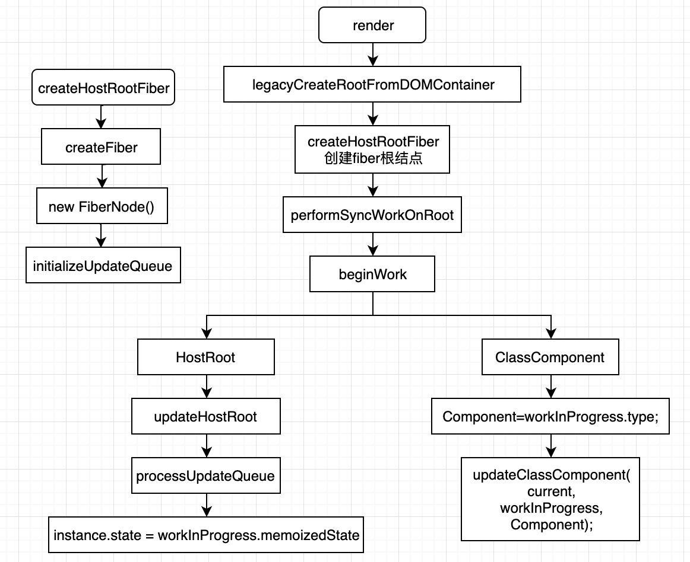
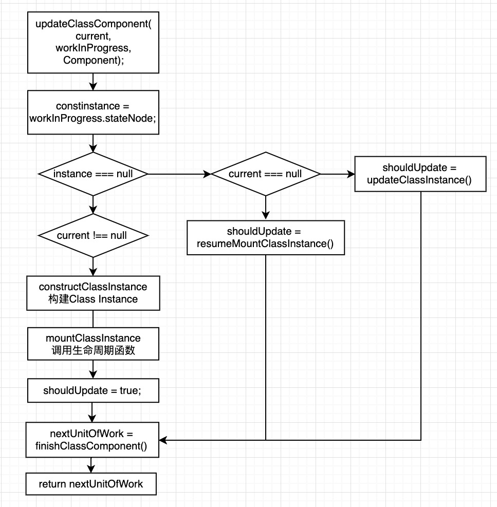

# react源码解析之setState和forceUpdate

## setState的使用 
```
setState(updater, [callback])
```
参数一为带有形式参数的 updater 函数：
```
(state, props) => stateChange
```
updater 的返回值会与 state 进行浅合并。

setState() 的第一个参数除了接受函数外，还可以接受对象类型：
```
setState(stateChange[, callback])
```
setState() 的第二个参数为可选的回调函数，它将在 setState 完成合并并重新渲染组件后执行。通常，我们建议使用 componen tDidUpdate() 来代替此方式。

## 关于 state和setState() 你应该了解的六件事

1. state对象保存在哪儿?
2. 为什么有时连续多次setState只有一次生效?
3. state更新到底在哪一阶段实现?
4. 执行完setState获取state的值能获取到吗?
5. setState是同步的还是异步的?
6. setState的callback执行时机
## 举例说明
🌰：
```js
class App extends React.Component {
  constructor() {
    this.state = { count: 0 };
  }

  componentDidMount() {
    console.log("componentDidMount");

    this.setState({ count: this.state.count + 1 });
    console.log(this.state.count);   // 0

    this.setState({ count: this.state.count + 1 });
    console.log(this.state.count);   // 0

    setTimeout(_ => {
      this.setState({ count: this.state.count + 1 });
      console.log(this.state.count); // 2

      this.setState({ count: this.state.count + 1 });
      console.log(this.state.count); // 3
    }, 0);
  }

  increment = () => {
    console.log("increment");
    this.setState({ count: this.state.count + 1 });
    console.log(this.state.count);  // 3
    this.setState({ count: this.state.count + 1 });
    console.log(this.state.count);  // 3
  };

  render() {
    console.log("render");
    return <div onClick={this.increment}>{this.state.count}</div>;
  }
}
```
控制台输出：
```
render
componentDidMount
0
0
render
render
2
render
3
```

触发点击事件后，控制台输出：
```
increment
3
3
render
```


## state对象初始化

在说对象初始化之前先看下fiberNode的创建和fiberNode的结构


```js
function FiberNode(
  tag: WorkTag,
  pendingProps: mixed,
  key: null | string,
  mode: TypeOfMode,
) {
  // Instance
  this.tag = tag;  // 用于标记fiber节点的类型
  this.key = key;  // 用于唯一标识一个fiber节点
  this.elementType = null;  // createElement的第一个参数，ReactElement上的type
  this.type = null;    // 表示fiber的真实类型 ，elementType基本一样，在使用了懒加载之类的功能时可能会不一样

  // 对于rootFiber根节点而言，stateNode属性指向对应的fiberRoot节点
  // 对于child fiber节点而言，stateNode属性指向对应的组件实例
  // 实力对象，比如class组件new完后就挂载在这个属性上面，如果是RootFiber，那么它上面挂的是FiberRoot
  this.stateNode = null;  

  // Fiber
  this.return = null;
  this.child = null;
  this.sibling = null;
  this.index = 0;  //  一般如果没有兄弟节点的话是0 当某个父节点下的子节点是数组类型的时候会给每个子节点一个index，index和key要一起做diff

  this.ref = null;  // reactElement上的ref属性

  this.pendingProps = pendingProps;  // 表示待处理的props数据
  this.memoizedProps = null;  // 表示之前已经存储的props数据
  this.updateQueue = null;  // 表示更新队列，例如在常见的setState操作中 其实会先将需要更新的数据存放到这里的updateQueue队列中用于后续调度
  this.memoizedState = null;  // 表示之前已经存储的state数据
  this.dependencies = null;

  this.mode = mode;  // 表示fiber节点的模式 表示当前组件下的子组件的渲染方式

  // Effects
  this.effectTag = NoEffect;  // 表示当前fiber要进行何种更新
  this.nextEffect = null;    // 指向下个需要更新的fiber

  this.firstEffect = null;   // 指向所有子节点里，需要更新的fiber里的第一个
  this.lastEffect = null;    // 指向所有子节点中需要更新的fiber的最后一个

  this.lanes = NoLanes;
  this.childLanes = NoLanes;

  this.alternate = null;   // current树和workInprogress树之间的相互引用
}
```

流程图：  

### initializeUpdateQueue


### performSyncWorkOnRoot
真正的渲染入口
performUnitOfWork 是 workLoopSync 和 workLoop 两个方法都会调用的方法，在其内部会调用 beginWork 方法，beginWork 方法会返回下一个要执行的任务（next），如果 next 为空表示已经遍历到叶子节点了，则调用 completeUnitOfWork 可以执行完成逻辑了
### updateClassComponent


memoizedState为null
在进行workloop进行循环->

### constructClassInstance

```js
function constructClassInstance(
  workInProgress: Fiber,
  ctor: any,  // Component
  props: any,
): any {
  const instance = new ctor(props, context);
  const state = (workInProgress.memoizedState =
    instance.state !== null && instance.state !== undefined
      ? instance.state
      : null);
  adoptClassInstance(workInProgress, instance);
}
```

说明：
1. new ctor()
```js
constructor(props) {
  super(props);
  this.state = {number: 1};
}
```
instance对象如下图：


2. workInProgress.memoizedState值更新 instance.state
3. adoptClassInstance(workInProgress, instance)  
初始化 class instance

adoptClassInstance 方法其实就是将 instance 挂载在 workInProgress 上， 将 workInProgress 挂在 instance 上，这样 instance 和 workInProgress 对象实现了两者的相互引用。值得注意的是，updater 也是这个时候挂载到 instance 上的。这也就是我们在读 setState 源码的时候看到的那个 this.updater。这个 updater 在首次渲染的时候挂载到了 this 上。

```
workInProgress.stateNode = instance;
instance._reactInternals = workInProgress
```

```js
function adoptClassInstance(workInProgress: Fiber, instance: any): void {
  instance.updater = classComponentUpdater;
  workInProgress.stateNode = instance;
  // The instance needs access to the fiber so that it can schedule updates
  setInstance(instance, workInProgress);  // set方法
}

export function set(key, value) {
  key._reactInternals = value;
}
```
其中classComponentUpdater注入updater，setstate\forceupdate\replacestate会分别触发相对应的方法，后续会说为什么在这注入updater
```js
// /react/packages/react-reconciler/src/ReactFiberClassComponent.js
const classComponentUpdater = {
  isMounted,
  enqueueSetState(inst, payload, callback) {},
  enqueueReplaceState(inst, payload, callback) {},
  enqueueForceUpdate(inst, callback) {},
};
```
### mountClassInstance


### updateClassInstance
复用ClassComponent实例，更新props和state，调用生命周期API—componentWillMount()和componentDidMount() 和getSnapshotBeforeUpdate()，最终返回shouldUpdate:boolean

作用：调用更新生命周期，如果不应该重新渲染，则返回false。

该方法执行processUpdateQueue 和 checkShouldComponentUpdate方法
processUpdateQueue 执行更新
checkShouldComponentUpdate 用于判断组件是否需要更新，执行instance.shouldComponentUpdate方法

reuturn的值结合 checkHasForceUpdateAfterProcessing() || checkShouldComponentUpdate(）

checkHasForceUpdateAfterProcessing() 返回当前 hasForceUpdate值  
resetHasForceUpdateBeforeProcessing() 重置hasForceUpdate值为false

### resumeMountClassInstance
该方法与updateClassInstance()逻辑类似，就不再赘述了，但注意下两者调用生命周期 API 的不同：


### processUpdateQueue


### getStateFromUpdate


### finishClassComponent
判断是否执行render()，并返回render下的第一个child
省略

## setState流程

流程概括如下：  


Component 在初始化的时候，如果 updater 没有传入，默认使用ReactNoopUpdateQueue 进行初始化。

ReactNoopUpdateQueue 主要起到一个在非生产版本中警告(warning)的作用。真正的 updater 是在 render 中注入(inject)的。因此如果你在 constructor 中尝试调用 setState,也会给出相应的警告表明在非安装或已卸载的组件中不能使用setState。

这就对应上了之前classComponent的updater注入
### 前期准备阶段
前期准备阶段所做的事情概括起来就三点：

1. 计算 lane
2. 创建 update 并将更新放入队列中
### schedule
#### 概述

找到触发更新节点对应的 fiberRoot 节点，然后调对该节点的更新，分为两种情况：同步和异步，同步又可以分为两种：是否是 LegacyUnbatchedContext，如果是就不需要调度直接进入下一阶段（render phase），如果不是就放到下一帧立即执行，对于异步任务则需要根据优先级算出一个过期时间，然后再和队列里排队的任务进行比较找出马上要过期的那个任务在下一帧进入下一个阶段执行（render phase）。

流程图：    


说明：
- 判断嵌套更新，超过 50 次的嵌套更新就报错
- 找到 fiberRoot 对象并设置 lane
- 判断是否有高优先级的任务打断当前任务
- 根据当前 lane 是否等于 SyncLane 分为两个大的阶段假设我们就把它们叫做同步阶段和异步阶段

  - 同步阶段又可以分为两种情况:

    - executionContext = LegacyUnbatchedContext 时调用performSyncWorkOnRoot  
    - 其它方法之前设置 executionContext 调用 ensureRootIsScheduled，并且当 方法之前设置 executionContext 为 NoContext 时调用flushSyncCallbackQueue

  - 异步阶段通过 getCurrentPriorityLevel 获取 priorityLevel，然后调用 ensureRootIsScheduled

需要注意的是如果是通过 react element 上绑定的事件函数里面调用的 setState 方法，会在执行 setState 方法之前设置 executionContext |= EventContext;，所以在 scheduleUpdateOnFiber 方法中会进入下图的分支。


并且在 setState 执行完之后才会调用 flushSyncCallbackQueue 执行更新，此时采用调用 performSyncWorkOnRoot


而如果不是通过事件机制调用的 setState 会立即执行 flushSyncCallbackQueue，就会立即 performSyncWorkOnRoot


#### ensureRootIsScheduled
流程图：  


说明： 
当前 root.callbackNode 是和新传入的任务优先级比较，如果优先级相等则return；复用之前的任务
关闭当前任务
如果新任务的 newCallbackPriority 是 SyncLanePriority 就调用 scheduleSyncCallback
如果新任务的 newCallbackPriority 不是 SyncLanePriority 就计算出还剩多长时间任务过期（timeout）然后调用 scheduleCallback

#### scheduleSyncCallback

将传入的 callback 放入 syncQueue 中，然后调用 Scheduler_scheduleCallback 设置优先级为 Scheduler_ImmediatePriority，callback 为 flushSyncCallbackQueueImpl

#### scheduleCallback
将传入的 reactPriorityLevel 转换为 schedule 中的 priorityLevel 然后调用 Scheduler_scheduleCallback

#### unstable_scheduleCallback
流程图：  


```js
  var expirationTime = startTime + timeout;  // 过期时间 = startTime + timeout
  var newTask = {  // 创建一个任务
    id: taskIdCounter++,  // 任务节点的序号，创建任务时通过taskIdCounter 自增 1
    callback: callback,  //  callback: 就是我们要执行的任务内容performSyncWorkOnRoot
    priorityLevel: priorityLevel,  // 任务的优先级。优先级按 ImmediatePriority、UserBlockingPriority、NormalPriority、LowPriority、IdlePriority 顺序依次越低
    startTime: startTime,  // 时间戳，任务预期执行时间，默认为当前时间，即同步任务。可通过 options.delay 设为异步延时任务
    expirationTime: expirationTime, // 过期时间，scheduler 基于该值进行异步任务的调度。通过 options.timeout 设定或 priorityLevel 计算 timeout 值后，timeout 与 startTime 相加称为 expirationTime
    sortIndex: -1  // 默认值为 -1。对于异步延时任务，该值将赋为 expirationTime
  };
```
说明：
* 及时任务: 直接调用requestHostCallback(flushWork), 设置回调为flushWork
* 延时任务： 调用requestHostTimeout(handleTimeout)设置定时器回调， 定时器触发之后调用requestHostCallback(flushWork), 设置回调为flushWork
* requestHostCallback函数把flushWork设置为scheduledHostCallback
* 添加宏任务：requestHostCallback通过MessageChanel的 api 添加一个宏任务,使得最终的回调performWorkUntilDeadline在下一个事件循环才会执行

#### requestHostTimeout / handleTimeout / advanceTimers
省略

#### flushWork（执行任务）
flushWork作为requestHostCallback回调函数，在经历requestHostCallback复杂的Scheduler过程后，flushWork开始执行调度任务。
不详细说了，主要执行workLoop方法

源码精简：
```js
function workLoop(hasTimeRemaining, initialTime) {
  // 检查 TimerQueue中是否有到期任务，如果有就push 到 TaskQueue
  advanceTimers(currentTime);
  // 获取到期任务
  currentTask = peek(taskQueue);
  while(currentTask !== null && !(enableSchedulerDebugging )) {
    const callback = currentTask.callback;
    // 执行任务
    const continuationCallback = callback(didUserCallbackTimeout);
    currentTask = peek(taskQueue);  // while 循环处理 taskQueue，
  }
}
```

#### flushSyncCallbackQueueImpl
对于 scheduleSyncCallback 来说最终执行的scheduledHostCallback 就是 flushSyncCallbackQueueImpl
这个方法中就是循环执行 syncQueue 数组中的任务


#### flushSyncCallbackQueue
还记得最开始如果处于同步阶段并且 executionContext 为 NoContext 时调用flushSyncCallbackQueue 就会调用这个方法，这个方法首先去调用 Scheduler_cancelCallback 取消 immediateQueueCallbackNode，接着会执行 flushSyncCallbackQueueImpl 也就是上面那个方法，immediateQueueCallbackNode 的 callback 对应的就是 flushSyncCallbackQueueImpl，所以这个方法就是立即调用 flushSyncCallbackQueueImpl 去执行 syncQueue 中的回调任务而不是等待下一帧执行。

### render
#### 概述
从 rootFiber 开始循环遍历 fiber 树的各个节点，对于每个节点会根据节点类型调用不同的更新方法，比如对于 class 组件会创建实例对象，调用 updateQueue 计算出新的 state，执行生命周期函数等，再比如对于 HostComponent 会给它的 children 创建 fiber 对象，当一侧子树遍历完成之后会开始执行完成操作，即创建对应 dom 节点并添加到父节点下以及设置父节点的 effect 链，然后遍历兄弟节点对兄弟节点也执行上述的更新操作，就这样将整棵树更新完成之后就可以进入下一阶段（commit phase）。

#### 整体流程图


state值的更改就在render流程中，在render阶段执行到beginwork时

### commit
#### 概述
提交阶段主要做的事情就是对 render 阶段产生的 effect 进行处理，处理分为三个阶段

阶段一：在 dom 操作产生之前，这里主要是调用 getSnapshotBeforeUpdate 这个生命周期方法  
阶段二：处理节点的增删改，对于删除操作需要做特殊处理要同步删除它的子节点并且调用对应的生命周期函数  
阶段三：dom 操作完成之后还需要调用对应的生命周期函数，并且执行 updateQueue 中的 callback

#### 流程图


#### commitLayoutEffects
该方法是整个 commit 阶段最后一个循环执行的方法，内部主要调用方法 commitLayoutEffectOnFiber，内部是一个 switch 对于不同的节点进行不同的操作，和seState的callback相关的则是ClassComponent

执行 componentDidMount 或 componentDidUpdate，最后调用 commitUpdateQueue 处理 update，这里主要处理 update 上面的 callback，比如 setState 方法的第二个参数或是生成异常 update 对应的 callback（componentDidCatch）

所以说，callback是在commitRoot后完成的，即重新渲染后，执行完setState获取state的值获取的是修改之前的值，只有重新渲染后获取的值才是最新的值

## forceUpdate

setState执行enqueueSetState方法，forceUpdate执行enqueueForceUpdate方法

强制让组件重新渲染，也是给React节点的fiber对象创建update，并将该更新对象入队

与enqueueSetState()方法的流程类似，唯一不同的是多了个手动修改属性tag的值：
```js
//与setState不同的地方
//默认是0更新，需要改成2强制更新
update.tag = ForceUpdate;
```
可以看到createUpdate()方法中，初始化的tag值是UpdateState：
```js
function createUpdate(eventTime, lane, suspenseConfig) {
  const update = {
    eventTime, 
    lane, 
    suspenseConfig, // null
    tag: UpdateState, // 0  0更新 1替换 2强制更新 3捕获性的更新
    payload: null,
    callback: null,
    next: null,
  };
  return update;
}
```
## 总结

针对开始提出的六个问题，做一个总结

1. state对象保存在哪儿?  
fiber.memoizedState
2. 为什么有时连续多次setState只有一次生效?  

setState 的批量更新优化也是建立在“异步”（合成事件、钩子函数）之上的，在原生事件和setTimeout 中不会批量更新，在“异步”中如果对同一个值进行多次 setState ， setState 的批量更新策略会对其进行覆盖，取最后一次的执行，如果是同时 setState 多个不同的值，在更新时会对其进行合并批量更新。

3. state更新到底在哪一阶段实现?  
render阶段
4. 执行完setState获取state的值能获取到吗?

在合成事件和钩子函数中不能获取到，需要setState执行完后触发render重新渲染才会取到正确的值，
setTimeout或原生事件是同步的，所以可以获取到修改后的值。

5. setState是同步的还是异步的?

setState 只在合成事件和钩子函数中是“异步”的，在原生事件和 setTimeout 中都是同步的。

setState的“异步”并不是说内部由异步代码实现，其实本身执行的过程和代码都是同步的，只是合成事件和钩子函数的调用顺序在更新之前，导致在合成事件和钩子函数中没法立马拿到更新后的值，形式了所谓的“异步”，当然可以通过第二个参数 setState(partialState, callback) 拿到更新后的结果。

6. setState的callback执行时机
commit阶段


下面是针对合成事件、setTimeout/原生事件、钩子函数不同情况的流程图：

1. 合成事件  


2. setTimeout/原生事件  
  

3. 钩子函数  


