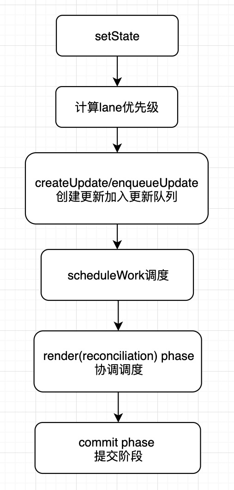
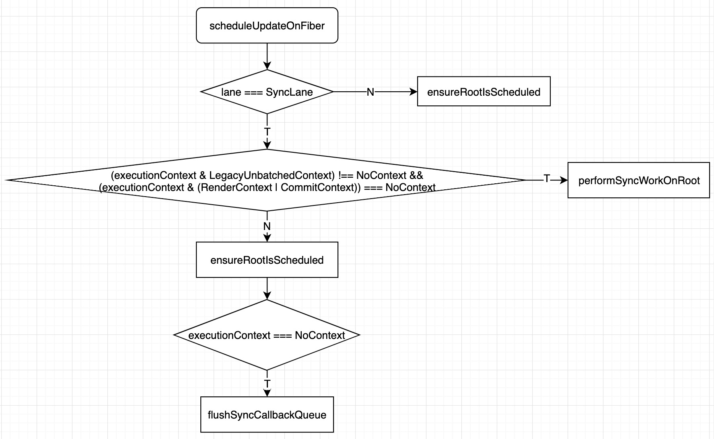

# react源码解析之setState和forceUpdate

## setState的使用 
```
setState(updater, [callback])
```
参数一为带有形式参数的 updater 函数：
```
(state, props) => stateChange
```
updater 的返回值会与 state 进行浅合并。

setState() 的第一个参数除了接受函数外，还可以接受对象类型：
```
setState(stateChange[, callback])
```
setState() 的第二个参数为可选的回调函数，它将在 setState 完成合并并重新渲染组件后执行。通常，我们建议使用 componentDidUpdate() 来代替此方式。

## 关于 setState() 你应该了解三件事

1. 为什么有时连续多次 setState只有一次生效？
2. 执行完setState获取state的值能获取到吗？
3. setState是同步的还是异步的？

下面针对这三件事来开展本次setState的分享

## 举例说明
🌰：
```js
class App extends React.Component {
  constructor() {
    this.state = { count: 0 };
  }

  componentDidMount() {
    console.log("componentDidMount");

    this.setState({ count: this.state.count + 1 });
    console.log(this.state.count);   // 0

    this.setState({ count: this.state.count + 1 });
    console.log(this.state.count);   // 0

    setTimeout(_ => {
      this.setState({ count: this.state.count + 1 });
      console.log(this.state.count); // 2

      this.setState({ count: this.state.count + 1 });
      console.log(this.state.count); // 3
    }, 0);
  }

  increment = () => {
    console.log("increment");
    this.setState({ count: this.state.count + 1 });
    console.log(this.state.count);  // 3
    this.setState({ count: this.state.count + 1 });
    console.log(this.state.count);  // 3
  };

  render() {
    console.log("render");
    return <div onClick={this.increment}>{this.state.count}</div>;
  }
}
```
控制台输出：
```
render
componentDidMount
0
0
render
render
2
render
3
```

触发点击事件后，控制台输出：
```
increment
3
3
render
```

## 整体流程



### 前期准备阶段
前期准备阶段所做的事情概括起来就三点：

1. 计算 lane
2. 创建 update 并将更新放入队列中

### schedule

#### 概述

找到触发更新节点对应的 fiberRoot 节点，然后调对该节点的更新，分为两种情况：同步和异步，同步又可以分为两种：是否是 LegacyUnbatchedContext，如果是就不需要调度直接进入下一阶段（render phase），如果不是就放到下一帧立即执行，对于异步任务则需要根据优先级算出一个过期时间，然后再和队列里排队的任务进行比较找出马上要过期的那个任务在下一帧进入下一个阶段执行（render phase）。

流程图：    


说明：
- 判断嵌套更新，超过 50 次的嵌套更新就报错
- 找到 fiberRoot 对象并设置 lane
- 判断是否有高优先级的任务打断当前任务
- 根据当前 lane 是否等于 SyncLane 分为两个大的阶段假设我们就把它们叫做同步阶段和异步阶段

  - 同步阶段又可以分为两种情况:

    - executionContext = LegacyUnbatchedContext 时调用performSyncWorkOnRoot  
    - 其它方法之前设置 executionContext 调用 ensureRootIsScheduled，并且当 方法之前设置 executionContext 为 NoContext 时调用flushSyncCallbackQueue

  - 异步阶段通过 getCurrentPriorityLevel 获取 priorityLevel，然后调用 ensureRootIsScheduled

需要注意的是如果是通过 react element 上绑定的事件函数里面调用的 setState 方法，会在执行 setState 方法之前设置 executionContext |= EventContext;，所以在 scheduleUpdateOnFiber 方法中会进入下图的分支。



并且在 setState 执行完之后才会调用 flushSyncCallbackQueue 执行更新，此时采用调用 performSyncWorkOnRoot


而如果不是通过事件机制调用的 setState 会立即执行 flushSyncCallbackQueue，就会立即 performSyncWorkOnRoot


#### ensureRootIsScheduled
流程图：  


说明： 
当前 root.callbackNode 是和新传入的任务优先级比较，如果优先级相等则return；复用之前的任务
关闭当前任务
如果新任务的 newCallbackPriority 是 SyncLanePriority 就调用 scheduleSyncCallback
如果新任务的 newCallbackPriority 不是 SyncLanePriority 就计算出还剩多长时间任务过期（timeout）然后调用 scheduleCallback

#### scheduleSyncCallback

将传入的 callback 放入 syncQueue 中，然后调用 Scheduler_scheduleCallback 设置优先级为 Scheduler_ImmediatePriority，callback 为 flushSyncCallbackQueueImpl

#### scheduleCallback
将传入的 reactPriorityLevel 转换为 schedule 中的 priorityLevel 然后调用 Scheduler_scheduleCallback

#### unstable_scheduleCallback
流程图：  


```js
  var expirationTime = startTime + timeout;  // 过期时间 = startTime + timeout
  var newTask = {  // 创建一个任务
    id: taskIdCounter++,  // 任务节点的序号，创建任务时通过taskIdCounter 自增 1
    callback: callback,  //  callback: 就是我们要执行的任务内容performSyncWorkOnRoot
    priorityLevel: priorityLevel,  // 任务的优先级。优先级按 ImmediatePriority、UserBlockingPriority、NormalPriority、LowPriority、IdlePriority 顺序依次越低
    startTime: startTime,  // 时间戳，任务预期执行时间，默认为当前时间，即同步任务。可通过 options.delay 设为异步延时任务
    expirationTime: expirationTime, // 过期时间，scheduler 基于该值进行异步任务的调度。通过 options.timeout 设定或 priorityLevel 计算 timeout 值后，timeout 与 startTime 相加称为 expirationTime
    sortIndex: -1  // 默认值为 -1。对于异步延时任务，该值将赋为 expirationTime
  };
```
说明：
* 及时任务: 直接调用requestHostCallback(flushWork), 设置回调为flushWork
* 延时任务： 调用requestHostTimeout(handleTimeout)设置定时器回调， 定时器触发之后调用requestHostCallback(flushWork), 设置回调为flushWork
* requestHostCallback函数把flushWork设置为scheduledHostCallback
* 添加宏任务：requestHostCallback通过MessageChanel的 api 添加一个宏任务,使得最终的回调performWorkUntilDeadline在下一个事件循环才会执行

#### requestHostTimeout / handleTimeout / advanceTimers
省略

#### flushWork（执行任务）
flushWork作为requestHostCallback回调函数，在经历requestHostCallback复杂的Scheduler过程后，flushWork开始执行调度任务。
不详细说了，主要执行workLoop方法

源码精简：
```js
function workLoop(hasTimeRemaining, initialTime) {
  // 检查 TimerQueue中是否有到期任务，如果有就push 到 TaskQueue
  advanceTimers(currentTime);
  // 获取到期任务
  currentTask = peek(taskQueue);
  while(currentTask !== null && !(enableSchedulerDebugging )) {
    const callback = currentTask.callback;
    // 执行任务
    const continuationCallback = callback(didUserCallbackTimeout);
    currentTask = peek(taskQueue);  // while 循环处理 taskQueue，
  }
}
```

#### flushSyncCallbackQueueImpl
对于 scheduleSyncCallback 来说最终执行的scheduledHostCallback 就是 flushSyncCallbackQueueImpl
这个方法中就是循环执行 syncQueue 数组中的任务


#### flushSyncCallbackQueue
还记得最开始如果处于同步阶段并且 executionContext 为 NoContext 时调用flushSyncCallbackQueue 就会调用这个方法，这个方法首先去调用 Scheduler_cancelCallback 取消 immediateQueueCallbackNode，接着会执行 flushSyncCallbackQueueImpl 也就是上面那个方法，immediateQueueCallbackNode 的 callback 对应的就是 flushSyncCallbackQueueImpl，所以这个方法就是立即调用 flushSyncCallbackQueueImpl 去执行 syncQueue 中的回调任务而不是等待下一帧执行。

### render

#### 概述
从 rootFiber 开始循环遍历 fiber 树的各个节点，对于每个节点会根据节点类型调用不同的更新方法，比如对于 class 组件会创建实例对象，调用 updateQueue 计算出新的 state，执行生命周期函数等，再比如对于 HostComponent 会给它的 children 创建 fiber 对象，当一侧子树遍历完成之后会开始执行完成操作，即创建对应 dom 节点并添加到父节点下以及设置父节点的 effect 链，然后遍历兄弟节点对兄弟节点也执行上述的更新操作，就这样将整棵树更新完成之后就可以进入下一阶段（commit phase）。

#### 整体流程图


### commit

#### 概述
提交阶段主要做的事情就是对 render 阶段产生的 effect 进行处理，处理分为三个阶段

阶段一：在 dom 操作产生之前，这里主要是调用 getSnapshotBeforeUpdate 这个生命周期方法  
阶段二：处理节点的增删改，对于删除操作需要做特殊处理要同步删除它的子节点并且调用对应的生命周期函数  
阶段三：dom 操作完成之后还需要调用对应的生命周期函数，并且执行 updateQueue 中的 callback

#### 流程图


#### commitLayoutEffects
该方法是整个 commit 阶段最后一个循环执行的方法，内部主要调用两个方法 commitLayoutEffectOnFiber 和 commitAttachRef，第一个方法内部是一个 switch 对于不同的节点进行不同的操作：

1. ClassComponent：执行 componentDidMount 或 componentDidUpdate，最后调用 commitUpdateQueue 处理 update，这里不同于 processUpdateQueue，这里主要处理 update 上面的 callback，比如 setState 方法的第二个参数或是生成异常 update 对应的 callback（componentDidCatch）
2. HostRoot：也会调用 commitUpdateQueue，因为 ReactDOM.render 方法的第三个参数也可以接受一个 callback
3. HostComponent：判断如果有 autoFocus 则调用 focus 方法来获取焦点
其它类型暂且不表

## 总结

针对开始提出的三个问题，做一个总结
1. 为什么有时连续多次 setState只有一次生效？

批量更新, 减少state的频繁更新，从而避免重复的View刷新, render()的调用。


2. 执行完setState获取state的值能获取到吗？

在合成事件和钩子函数中不能获取到，需要setState执行完后触发render重新渲染才会取到正确的值，
setTimeout或原生事件是同步的，所以可以获取到修改后的值。

3. setState是同步的还是异步的？

setState 只在合成事件和钩子函数中是“异步”的，在原生事件和 setTimeout 中都是同步的。
setTimeout或原生事件没有走React的合成事件机制，React的合成事件机制是异步的, 但是setState本身是个同步的。


