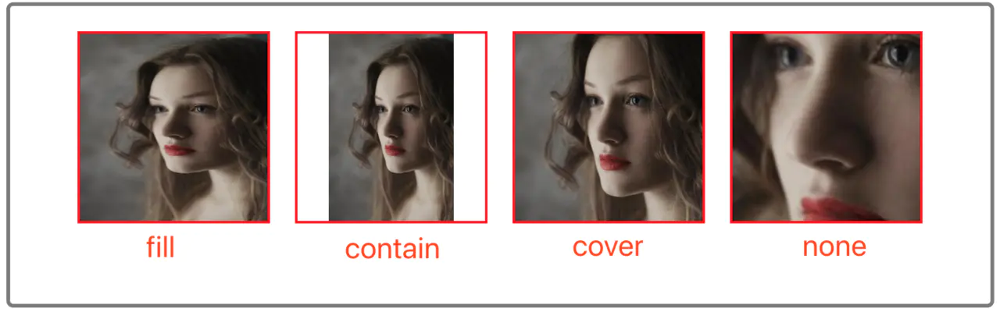
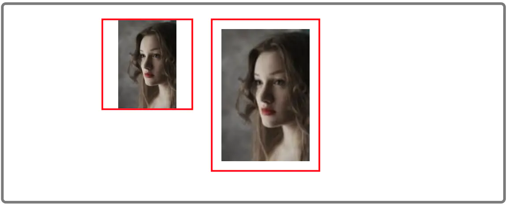

# 瀑布流布局的5种实现方式及object-fit

## object-fit

CSS3 的 object-fit 属性是用来指定「可替换元素」的内容是如何适应到容器中的。它的值有 5 种。分别为：fill | contain | cover | none | scale-down。先看下效果在来一一解释它们到底都是什么意思。



* fill：会充满整个容器，不考虑宽高比，所以会被拉伸变形。
* contain：会缩放到容器内，保持宽高比。
* cover：会保持比例进行缩放，内容的尺寸一定会大于等于容器，然后进行裁剪。
* none：保持图片的原始尺寸。

而 scale-down 有两种表现方式所以我们单独来看。  
scale-down：会在 none 或 contain 中选择一个，原则是：当容器小时，它的表现和 contain 一样；当图片小时，它的表现和 none 一样。即谁小选择谁。  


元素其实与内容是相互独立的。相当于一个外壳包裹着内容。你控制的只是 元素的尺寸。而内容的尺寸则由 object-fit 属性控制。

综上索述， 是一个空间占位符，并不控制内容。


## 等宽瀑布流


### JS 计算列数
关键思路：

* 首先设置列宽度，然后计算能够展示的列数。
* 向每一列中添加图片。

优势：思路清晰简单，不需要做过多的计算，只要计算需要显示的列数然后添加图片即可。  
劣势：每列的末尾可能不够友好，可能出现有些列会很长，有些又会很短。

### 利用绝对定位
关键思路：

* 首先设置列宽度，然后计算能够展示的列数。
* 把图片设置为绝对定位，然后计算出每个图片的top，left值。
* 先把第一行图片排好，top 为 0，left 为 列的索引*列宽。
* 从第二行开始，每张图片都放到最短的一列下面。然后增加此列高度，此时列的高度发生变化，下张图片又会寻找其他最短的列。以此持续计算下去。


优势：因为每次追加的图片都是最短列，所以末尾的展示会比思路 1 中要友好很多。  
劣势：没渲染一张都会计算一次 top，left 值。而且图片的顺序是打乱的。

### CSS3 column 属性
关键思路：
* column-count：指定列数
* column-gap: 设置列之间的间距

```css
column-count: 3;
column-gap: 10px;
  .image-box {
    img {
      display: block;
      width: 100%;
    }
  }
}
```
优势：更加简单，不用额外计算，直接用CSS渲染高效
劣势：图片顺序是从上倒下排列的，另外列数固定

## 等高瀑布流


### JS计算缩放
* 首先给定一个基准高度
* 图片获取基准高度下的宽度，然后计算每一行能够放入多少张
* 此时每一行图片肯定会小于容器宽度，然后这一行进行缩放到容器大小。在重新计算放大后的高度

优势：图片的内容得到全部展示，不会被隐藏。  
劣势：需要反复计算以及缩放。

代码：
```js
const baseHeight = 120;  // 图片基础高度
let rowWidth = 0;        // 每行图片的宽度
let rowCount = 0;        // 每行索引
const imgList = [[]];    // 二维数组存放每一行数据

for (let i = 0; i < list.length; i++) {
  compare({
    url: list[i].src,
    width: baseHeight * (list[i].style.width / list[i].style.height),
    height: baseHeight,
    img: list,
    style: list[i].style
  });
}

function compare(image) {
  let clientWidth = 245;  // 容器宽度
  rowWidth += image.width;
  // 假设图片之间的间距为5px
  if (rowWidth + 5 > clientWidth) {
    clientWidth = clientWidth - (image.img[rowCount].length - 1) * 5;
    rowWidth = rowWidth - image.width;
    let ratio = clientWidth / rowWidth;
    image.img[rowCount].forEach(item => {
      item.height = item.height * ratio;
      item.width = item.width * ratio;
    });
    rowWidth = image.width;
    rowCount++;
    image.img[rowCount] = [image];
  } else {
    image.img[rowCount].push(image);
  }
}
```