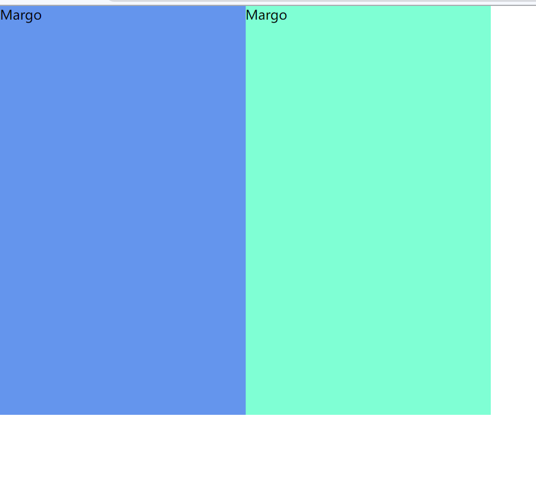
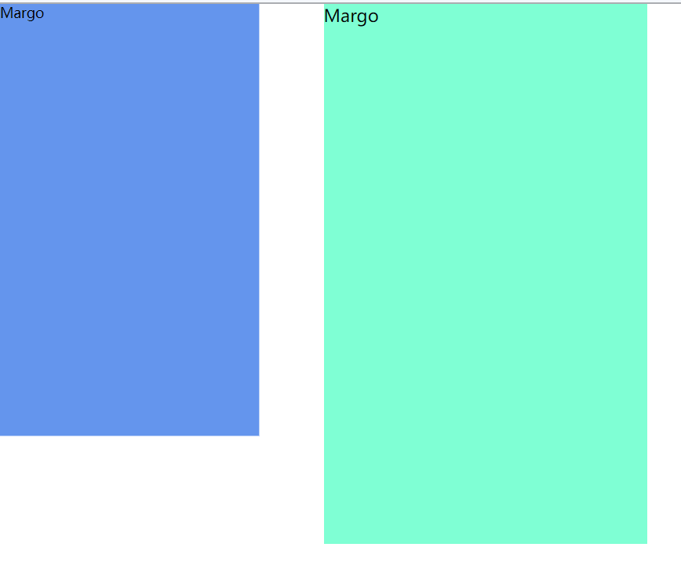
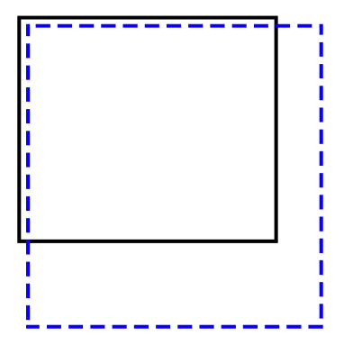
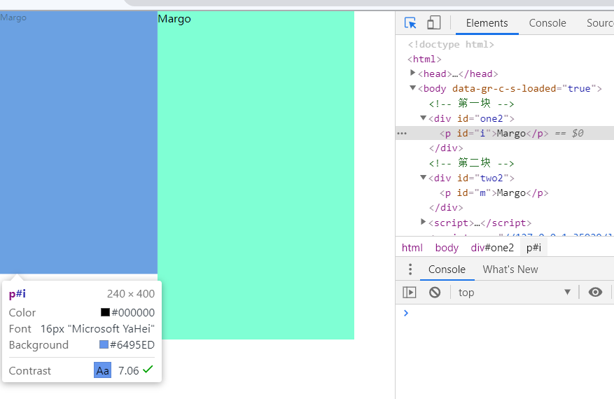

# scale的空白问题

## transform属性
transform布局不会脱离文档流，也不改变文档流的大小和位置。

首先是没有进行缩放的图


进行缩放后
```css
#i {
  width: 300px;
  height: 500px;
  float: left;
  transform: scale(0.8);
  transform-origin: 0 0;
}
#m {
  float: left;
  width: 300px;
  height: 500px;
}
```
```html
<p id="i">Margo</p>
<p id="m">Margo</p>
```



所以元素还是占据了定义时的大小

## 解决方法

### 方法1
把被缩放元素的margin改为负值，改的值为： 缩放前的值 - (scale()里面的值*缩放前的值)

即 width = 300-(0.8*300)=60px

### 方法2
思路就是在被缩小的外面套一层，并设置外面层的大小为里层缩放后的大小

图示：里面层的实际大小要比外面层大

* 实线: 为外层,代码中的div标签
* 虚线: 为里层,对应代码中的p标签




假设最里层为300x500 缩放的值0.8，则缩放后的大小为240x400

再加上: -webkit-transform-origin: 0 0; 把最外层的div的大小设置为缩放后的图像的大小(240x400)

```css
#one2 {
  float:left;
  width: 240px;
  height: 400px;
}
#two2 {
  float: left;
}
#i {
  width: 300px;
  height: 500px;
  float: left;
  transform: scale(0.8);
  transform-origin: 0 0;
}
#m {
  float: left;
  width: 300px;
  height: 500px;
}
```
```html
<div id="one2">
  <p id="i">Margo</p>
</div>
<div id="two2">
  <p id="m">Margo</p>
</div>
```

