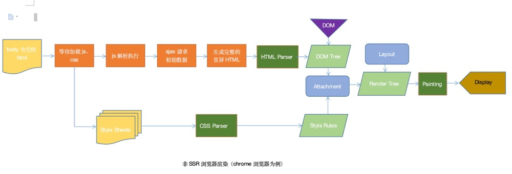
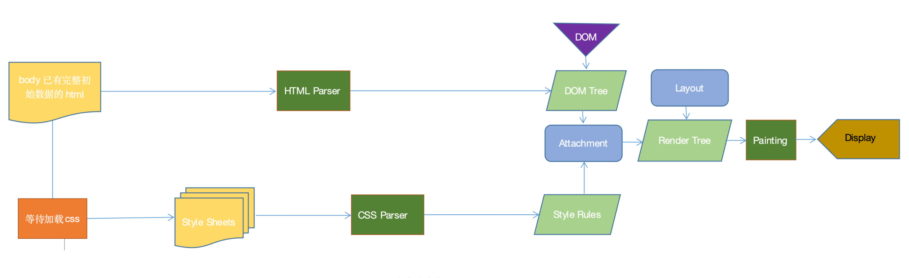

# ssr的过程

## 什么是服务端渲染？

简单理解是将组件或页面通过服务器生成html字符串，再发送到浏览器，最后将静态标记"混合"为客户端上完全交互的应用程序

## csr vs  ssr
csr: 客户端渲染渲染，当请求user页面时，返回的body里为空，之后执行js将html结构注入到body里，结合css显示出来；

ssr: 服务端渲染，当请求user页面时，返回的body里已经有了首屏的html结构，之后结合css显示出来

对比 ads 和 keeper

## csr 和 ssr 渲染过程

服务端渲染是先向后端服务器请求数据，然后生成完整首屏html返回给浏览器；而客户端渲染是等js代码下载、加载、解析完成后再请求数据渲染，等待的过程页面是什么都没有的，就是用户看到的白屏。就是服务端渲染不需要等待js代码下载完成并请求数据，就可以返回一个已有完整数据的首屏页面。

## 优点

### 更利于SEO

返回给客户端的是已经获取了异步数据并执行JavaScript脚本的最终HTML，网络爬中就可以抓取到完整页面的信息。

### 更快

更利于首屏渲染

1、请求少
2、内网请求快
3、首屏不需要等待，js代码下载、加载、解析

首屏的渲染是node发送过来的html字符串，并不依赖于js文件了，这就会使用户更快的看到页面的内容。尤其是针对大型单页应用，打包后文件体积比较大，普通客户端渲染加载所有所需文件时间较长，首页就会有一个很长的白屏等待时间。

## 缺点

### 服务端压力较大

尤其是高并发访问的情况，会大量占用服务端CPU资源；

### 学习成本相对较高

除了对webpack、React要熟悉，还需要掌握node、Koa2等相关技术。相对于客户端渲染，项目构建、部署过程更加复杂。

## QA
1. Parser
HTML Parser ： HTML解析器  
CSS Parser： CSS 解析器  

2. 占位符

react在node打包后插入占位符。
