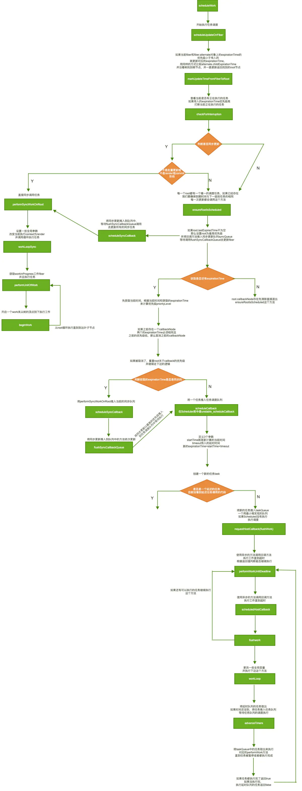

# React任务调度 scheduleWork

## 源码

```js
/**
 * 开始进行任务调度
 * @param {*} fiber
 * @param {*} expirationTime
 */
export function scheduleUpdateOnFiber(
  fiber: Fiber,
  expirationTime: ExpirationTime,
) {
  // 检查最大update的数量是否超过了最大值
  checkForNestedUpdates();

  // 找到rootFiber并遍历更新子节点的expirationTime
  const root = markUpdateTimeFromFiberToRoot(fiber, expirationTime);
  if (root === null) {
    // 如果找不到root报警告
    warnAboutUpdateOnUnmountedFiberInDEV(fiber);
    return;
  }
  // 查看当前是否能被打断
  checkForInterruption(fiber, expirationTime);

  const priorityLevel = getCurrentPriorityLevel();   //获取当前优先级
  // 如果expirationTime等于最大整型值的话 当前是同步更新的
  if (expirationTime === Sync) {
    //如果还未渲染，update是未分批次的，
    //也就是第一次渲染前
    if (
      // 如果正在执行的上下文是unbatchUpdate不是批量更新
      (executionContext & LegacyUnbatchedContext) !== NoContext &&
      // 检查不是render或者commit阶段
      (executionContext & (RenderContext | CommitContext)) === NoContext
    ) {
      // 跟踪这些update，并计数、检测它们是否会报错
      schedulePendingInteractions(root, expirationTime);
      // 同步调用任务
      performSyncWorkOnRoot(root);
    } else {
      // 进入render阶段
      ensureRootIsScheduled(root);       // 立即执行调度任务
      schedulePendingInteractions(root, expirationTime);
      if (executionContext === NoContext) {   // 当前没有update时
        // 执行同步更新队列
        flushSyncCallbackQueue();
      }
    }
  } else {
    // 异步
    ensureRootIsScheduled(root);
    schedulePendingInteractions(root, expirationTime);
  }
}
```
### 步骤分析

* 我们需要用fiber对象找到根节点root元素。react遵循的是单向数据流更新都是从上到下的。这个过程就是沿着return属性一路去找到根元素，并一路更新遍历到的fiber的expirationTime
* 检查当前有没有正在执行的任务，如果当前优先级高就需要打断之前正在执行的任务。
* 接下来会判断过期时间是同步更新的会进行一些检查正在执行的上下文是unbatchUpdate不是批量更新并且当前没有render和commit阶段，就会直接执行performSyncWorkOnRoot方法进行同步调用任务，虽是同步更新但是是批量更新，或者当前已经进入commit阶段，那么也不能直接执行，因为js是单线程，也需要排队等待。
可以看到异步的优先级和同步的分支都会调用ensureRootIsScheduled这个方法

## checkForNestedUpdates
作用：判断是否是无限循环的update
```js
const NESTED_UPDATE_LIMIT = 50;
function checkForNestedUpdates() {
  if (nestedUpdateCount > NESTED_UPDATE_LIMIT) {   
    nestedUpdateCount = 0;
    rootWithNestedUpdates = null;
    invariant(
      false,
      'Maximum update depth exceeded. This can happen when a component ' +
        'repeatedly calls setState inside componentWillUpdate or ' +
        'componentDidUpdate. React limits the number of nested updates to ' +
        'prevent infinite loops.',
    );
  }
}
```
### 解析
超过 50层嵌套update，就终止进行调度，并报出error
造成死循环有两种情况：
* render()中无条件调用setState()
* shouldComponentUpdate()和componentWillUpdate()中调用setState()

## markUpdateTimeFromFiberToRoot
作用：找到rootFiber并遍历更新子节点的expirationTime
```js
function markUpdateTimeFromFiberToRoot(fiber, expirationTime) {
  //如果fiber对象的过期时间小于 expirationTime，则更新fiber对象的过期时间

  //也就是说，当前fiber的优先级是小于expirationTime的优先级的，现在要调高fiber的优先级
  if (fiber.expirationTime < expirationTime) {
    fiber.expirationTime = expirationTime;
  }
  //在enqueueUpdate()中有讲到，与fiber.current是映射关系
  let alternate = fiber.alternate;
  //同上
  if (alternate !== null && alternate.expirationTime < expirationTime) {
    alternate.expirationTime = expirationTime;
  }
  //向上遍历父节点，直到root节点，在遍历的过程中更新子节点的expirationTime
  //fiber的父节点
  let node = fiber.return;
  let root = null;
  //node=null,表示是没有父节点了，也就是到达了RootFiber，即最大父节点
  //HostRoot即树的顶端节点root
  if (node === null && fiber.tag === HostRoot) {
    //RootFiber的stateNode就是FiberRoot
    root = fiber.stateNode;
  }
  //没有到达FiberRoot的话，则进行循环
  else {
    while (node !== null) {
      alternate = node.alternate;
      //如果父节点的所有子节点中优先级最高的更新时间仍小于expirationTime的话
      //则提高优先级
      if (node.childExpirationTime < expirationTime) {
        //重新赋值
        node.childExpirationTime = expirationTime;
        //alternate是相对于fiber的另一个对象，也要进行更新
        if (
          alternate !== null &&
          alternate.childExpirationTime < expirationTime
        ) {
          alternate.childExpirationTime = expirationTime;
        }
      }
      //别看差了是对应(node.childExpirationTime < expirationTime)的if
      else if (
        alternate !== null &&
        alternate.childExpirationTime < expirationTime
      ) {
        alternate.childExpirationTime = expirationTime;
      }
      //如果找到顶端rootFiber，结束循环
      if (node.return === null && node.tag === HostRoot) {
        root = node.stateNode;
        break;
      }
      node = node.return;
    }
  }
  //更新该rootFiber的最旧、最新的挂起时间
  if (root !== null) {
    // Update the first and last pending expiration times in this root
    const firstPendingTime = root.firstPendingTime;
    if (expirationTime > firstPendingTime) {
      root.firstPendingTime = expirationTime;
    }
    const lastPendingTime = root.lastPendingTime;
    if (lastPendingTime === NoWork || expirationTime < lastPendingTime) {
      root.lastPendingTime = expirationTime;
    }
  }

  return root;
}
```
### 解析
* 更新fiber对象的expirationTime
* 根据fiber.return向上遍历寻找RootFiber（fiber的顶层对象）
* 在向上遍历的过程中，更新父对象fiber.return子节点的childExpirationTime
* 找到RootFiber后，根据RootFiber.stateNode=FiberRoot的关系，找到FiberRoot
* 更新该rootFiber的最旧、最新的挂起时间
* 返回RootFiber

## checkForInterruption
作用：判断是否有高优先级任务打断当前正在执行的任务
```js
//判断是否有高优先级任务打断当前正在执行的任务
function checkForInterruption(
  fiberThatReceivedUpdate: Fiber,
  updateExpirationTime: ExpirationTime,
) {
  //如果任务正在执行，并且异步任务已经执行到一半了，
  //但是现在需要把执行权交给浏览器，去执行优先级更高的任务
  if (
    enableUserTimingAPI &&
    workInProgressRoot !== null &&
    updateExpirationTime > renderExpirationTime
  ) {
    //打断当前任务，优先执行新的update
    interruptedBy = fiberThatReceivedUpdate;
  }
}
```
## getCurrentPriorityLevel
作用：获取当前调度任务的优先级
```js
//除了90，用数字是因为这样做，方便比较
//从90开始的原因是防止和Scheduler的优先级冲突
export const ImmediatePriority: ReactPriorityLevel = 99;
export const UserBlockingPriority: ReactPriorityLevel = 98;
export const NormalPriority: ReactPriorityLevel = 97;
export const LowPriority: ReactPriorityLevel = 96;
export const IdlePriority: ReactPriorityLevel = 95;
export const NoPriority: ReactPriorityLevel = 90;

//获取当前调度任务的优先级
export function getCurrentPriorityLevel(): ReactPriorityLevel {
  switch (Scheduler_getCurrentPriorityLevel()) {
      //99
    case Scheduler_ImmediatePriority:
      return ImmediatePriority;
      //98
    case Scheduler_UserBlockingPriority:
      return UserBlockingPriority;
      //97
    case Scheduler_NormalPriority:
      return NormalPriority;
      //96
    case Scheduler_LowPriority:
      return LowPriority;
      //95
    case Scheduler_IdlePriority:
      return IdlePriority;
    default:
      invariant(false, 'Unknown priority level.');
  }
}
```
```js
// unstable_getCurrentPriorityLevel
const {
  unstable_getCurrentPriorityLevel: Scheduler_getCurrentPriorityLevel,
} = Scheduler;

function unstable_getCurrentPriorityLevel() {
  return currentPriorityLevel;
}
//当前调度优先级默认为 NormalPriority
var currentPriorityLevel = NormalPriority;
```
### 解析
scheduler优先级是90往上，并且默认是NormalPriority（97）

## ensureRootIsScheduled
作用：真正任务调度的入口
```js
// 每一个root都有一个唯一的调度任务，如果已经存在，我们要确保到期时间与下一级别任务的相同，每一次更新都会调用这个方法
function ensureRootIsScheduled(root: FiberRoot) {
  const lastExpiredTime = root.lastExpiredTime;
  // 最近的到期时间不为NoWork： 0 ,说明已经过期需要同步更新
  if (lastExpiredTime !== NoWork) {
    root.callbackNode = scheduleSyncCallback(
      performSyncWorkOnRoot.bind(null, root),
    );
    return;
  }
  const expirationTime = getNextRootExpirationTimeToWorkOn(root);
  const existingCallbackNode = root.callbackNode;
  // 说明接下来没有可调度的任务
  if (expirationTime === NoWork) {
    return;
  }
  const currentTime = requestCurrentTimeForUpdate();
  // 根据过去时间和当前时间计算出任务优先级
  const priorityLevel = inferPriorityFromExpirationTime(
    currentTime,
    expirationTime,
  );
  // 如果存在一个渲染任务，必须有相同的到期时间，确认优先级如果当前任务的优先级高就取消之前的任务安排一个新的任务
  if (existingCallbackNode !== null) {
    const existingCallbackPriority = root.callbackPriority;
    const existingCallbackExpirationTime = root.callbackExpirationTime;
    if (
      // Callback must have the exact same expiration time.
      existingCallbackExpirationTime === expirationTime &&
      // Callback must have greater or equal priority.
      existingCallbackPriority >= priorityLevel
    ) {
      // Existing callback is sufficient.
      return;
    }
    cancelCallback(existingCallbackNode);  //取消之前的任务
  }
  // 取消了之前的任务需要重置为当前最新的
  root.callbackExpirationTime = expirationTime;
  root.callbackPriority = priorityLevel;
  let callbackNode;
  if (expirationTime === Sync) { // 同步调用
    callbackNode = scheduleSyncCallback(performSyncWorkOnRoot.bind(null, root));
  } else { // 异步调用
    callbackNode = scheduleCallback(
      priorityLevel,
      performConcurrentWorkOnRoot.bind(null, root),
      {timeout: expirationTimeToMs(expirationTime) - now()},
    );
  }
  root.callbackNode = callbackNode;
}
```

### 步骤分析
* 最近到期时间为NoWork，已经过期，需要同步更新
* 获取过期时间expirationTime 为NoWork，说明没有可调度任务，退出
* 根据过去时间和当前时间计算出任务优先级，优先级高于目前的任务，则取消当前的任务，安排新任务
* 判断任务为同步调用还是异步调用，同步采用scheduleSyncCallback(performSyncWorkOnRoot),异步采用scheduleCallback(performConcurrentWorkOnRoot)，且异步传入timeout

## scheduleCallback异步
异步的任务调度很简单，直接将异步任务推入调度队列
```js
export function scheduleCallback(
  reactPriorityLevel: ReactPriorityLevel,
  callback: SchedulerCallback,
  options: SchedulerCallbackOptions | void | null,
) {
  const priorityLevel = reactPriorityToSchedulerPriority(reactPriorityLevel);
  return Scheduler_scheduleCallback(priorityLevel, callback, options);
}
```

### scheduleSyncCallback
作用：将同步任务推入同步队列syncQueue，等待flushSyncCallbackQueue调用将所有同步任务推入真正的任务队列。如果第一次的同步任务会直接加入调度队列
```js
/**
 * 同步任务调度的中间方法,如果队列不为空就加入队列，如果为空就立即推入任务调度队列
 * @param {*} callback
 */
export function scheduleSyncCallback(callback: SchedulerCallback) {
  if (syncQueue === null) {
    syncQueue = [callback];
    immediateQueueCallbackNode = Scheduler_scheduleCallback(
      Scheduler_ImmediatePriority,
      flushSyncCallbackQueueImpl,
    );
  } else {
    syncQueue.push(callback);
  }
  return fakeCallbackNode;
}
```

## Scheduler_scheduleCallback
作用：任务调度队列的代码不管同步异步都是用这个方法加入任务队列执行的Scheduler_scheduleCallback对应源码是unstable_scheduleCallback这方法

```js
/**
 * 将一个任务推入任务调度队列
 * @param {*} priorityLevel 当前任务优先级
 * @param {*} callback
 * @param {*} options 异步调度传入timeout类似setTimeout的时间
 */
function unstable_scheduleCallback(priorityLevel, callback, options) {
  var currentTime = getCurrentTime();// 获取当前的时间的相对值即当前时间减去页面加载记录的时间
  var startTime;
  var timeout;
  if (typeof options === 'object' && options !== null) {
    // 如果没有timeout就是使用优先级计算出来的
    timeout =
      typeof options.timeout === 'number'
        ? options.timeout
        : timeoutForPriorityLevel(priorityLevel);
  } else {
    // 针对不同的优先级算出不同的过期时间
    timeout = timeoutForPriorityLevel(priorityLevel);
    startTime = currentTime;
  }
  // 定义新的过期时间
  var expirationTime = startTime + timeout;
  // 定义一个新的任务
  var newTask = {
    id: taskIdCounter++,
    callback,
    priorityLevel,
    startTime,
    expirationTime,
    sortIndex: -1,
  };
  if (startTime > currentTime) {
    // 这是一个delay的任务
    newTask.sortIndex = startTime;
    // 将超时的任务推入超时队列
    push(timerQueue, newTask);
    // 如果任务队列为空且新增加的任务是优先级最高
    if (peek(taskQueue) === null && newTask === peek(timerQueue)) {
      // 如果已经有hostTimeout在执行需要取消之前的
      if (isHostTimeoutScheduled) {
        cancelHostTimeout();
      } else {
        isHostTimeoutScheduled = true;
      }
      requestHostTimeout(handleTimeout, startTime - currentTime);
    }
  } else {
    newTask.sortIndex = expirationTime;
    // 将新的任务推入任务队列
    push(taskQueue, newTask);
    // 执行回调方法，如果已经再工作需要等待一次回调的完成
    if (!isHostCallbackScheduled && !isPerformingWork) {
      isHostCallbackScheduled = true;
      requestHostCallback(flushWork);
    }
  }
  return newTask;
}
```

### 步骤分析
异步的方法会传入一个timeout参数可以直接使用，如果没有会根据优先级计算出来一个固定的值，对于每一个任务都会定义一个成一个新的任务task。任务队列实际是一个基于数组实现的最小堆，排序的key就是新计算出来的expirationTime所以这里可以看到不管同步还是异步任务最终都是推入了一个任务队列中等待执行。最后执行requestHostCallbacky用MessageChannel的异步方法来开启任务调度performWorkUntilDeadline

```js
  requestHostCallback = function (callback) {
    scheduledHostCallback = callback;

    if (!isMessageLoopRunning) {
      isMessageLoopRunning = true;
      port.postMessage(null);
    }
  };
```

## performWorkUntilDeadline

```js
// 执行工作直到超时
const performWorkUntilDeadline = () => {
  // 可能有被取消的情况
  if (scheduledHostCallback !== null) {
    const currentTime = getCurrentTime();
    deadline = currentTime + yieldInterval;
    const hasTimeRemaining = true;
    try {
      const hasMoreWork = scheduledHostCallback(
        hasTimeRemaining,
        currentTime,
      );
      // 如果没有更多的工作
      if (!hasMoreWork) {
        isMessageLoopRunning = false;
        scheduledHostCallback = null;
      } else {
        // 如果有更多的工作就一直触发
        port.postMessage(null);
      }
    } catch (error) {
      port.postMessage(null);
      throw error;
    }
  } else {
    isMessageLoopRunning = false;
  }
  needsPaint = false;
};
```
scheduledHostCallback就是之前传入的flushWork在这里调用的是workLoop去循环执行所有的任务

```js
// 循环工作将task中的任务都执行了
function workLoop(hasTimeRemaining, initialTime) {
  let currentTime = initialTime;
  advanceTimers(currentTime);
  currentTask = peek(taskQueue); // 获得当前优先级最高的任务
  // 任务不为空且任务没有被暂停
  while (
    currentTask !== null &&
    !(enableSchedulerDebugging && isSchedulerPaused)
  ) {
    if (
      currentTask.expirationTime > currentTime && // 如果当前的到期时间比较长可以先执行其他任务
      (!hasTimeRemaining || shouldYieldToHost()) // 并且可以暂停
    ) {
      break;
    }
    const callback = currentTask.callback;
    if (callback !== null) {
      currentTask.callback = null;
      currentPriorityLevel = currentTask.priorityLevel;
      const didUserCallbackTimeout = currentTask.expirationTime <= currentTime;
      markTaskRun(currentTask, currentTime);
      // 执行performWorkOnRoot
      const continuationCallback = callback(didUserCallbackTimeout);
      // 执行完后再获取一次时间
      currentTime = getCurrentTime();
      if (typeof continuationCallback === 'function') {
        currentTask.callback = continuationCallback;
        markTaskYield(currentTask, currentTime);
      } else {
        if (enableProfiling) {
          markTaskCompleted(currentTask, currentTime);
          currentTask.isQueued = false;
        }
        // 如果当前任务是最高优先级的直接推出
        if (currentTask === peek(taskQueue)) {
          pop(taskQueue);
        }
      }
      advanceTimers(currentTime);
    } else {
      pop(taskQueue);
    }
    currentTask = peek(taskQueue);
  }
  // 返回当前队列里是否还有任务，
  if (currentTask !== null) {
    return true;
  } else {
    let firstTimer = peek(timerQueue);
    if (firstTimer !== null) {
      requestHostTimeout(handleTimeout, firstTimer.startTime - currentTime);
    }
    return false;
  }
}
```

这里其实就是从任务队列中取出优先级最高的任务去执行，对于同步任务执行的是performSyncWorkOnRoot对于异步的任务执行的是performConcurrentWorkOnRoot
最终都会在while循环中之心performUnitOfWork这个方法只不过异步的方法是可以打断的，我们每次调用都要查看是否超时。


## 具体流程


