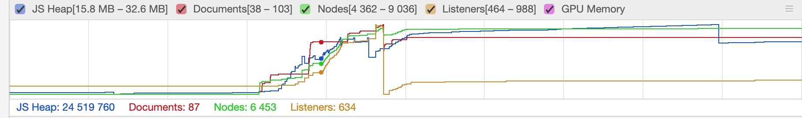

# JS 内存管理

## 引言
通过平时多了解一些 JS 中内存管理问题, 在写代码中通过一些习惯, 避免内存泄露的问题.

## 内容概述

### JS 内存生命周期

JS 环境中分配的内存有如下声明周期：
1. 内存分配：当我们申明变量、函数、对象的时候，系统会自动为他们分配内存
2. 内存使用：即读写内存，也就是使用变量、函数等
3. 内存回收：使用完毕，由垃圾回收机制自动回收不再使用的内存

不管什么程序语言，内存生命周期基本是一致的。
在 C 语言中, 有专门的内存管理接口, 像malloc() 和 free(). 而在 JS 中, 没有专门的内存管理接口, 所有的内存管理都是"自动"的. JS 在创建变量时, 自动分配内存, 并在不使用的时候, 自动释放. 这种"自动"的内存回收, 造成了很多 JS 开发并不关心内存回收, 实际上, 这是错误的.

### JS 的内存分配

为了不让程序员费心分配内存，JavaScript 在定义变量时就完成了内存分配。
```js
var n = 123; // 给数值变量分配内存
var s = "azerty"; // 给字符串分配内存

var o = {
  a: 1,
  b: null
}; // 给对象及其包含的值分配内存

// 给数组及其包含的值分配内存（就像对象一样）
var a = [1, null, "abra"]; 

function f(a){
  return a + 2;
} // 给函数（可调用的对象）分配内存

// 函数表达式也能分配一个对象
someElement.addEventListener('click', function(){
  someElement.style.backgroundColor = 'blue';
}, false);
```

### JS 的内存使用
使用值的过程实际上是对分配内存进行读取与写入的操作。 读取与写入可能是写入一个变量或者一个对象的属性值，甚至传递函数的参数。
```js
var a = 10; // 分配内存
console.log(a); // 对内存的使用
```
### JS 的内存回收
JS 有自动垃圾回收机制，其实很简单，就是找出那些不再继续使用的值，然后释放其占用的内存。

大多数内存管理的问题都在这个阶段。在这里最艰难的任务是找到不再需要使用的变量。不再需要使用的变量也就是生命周期结束的变量，是局部变量，局部变量只在函数的执行过程中存在，当函数运行结束，没有其他引用(闭包)，那么该变量会被标记回收。全局变量的生命周期直至浏览器卸载页面才会结束，也就是说全局变量不会被当成垃圾回收。

因为自动垃圾回收机制的存在，开发人员可以不关心也不注意内存释放的有关问题，但对无用内存的释放这件事是客观存在的。不幸的是，即使不考虑垃圾回收对性能的影响，目前最新的垃圾回收算法，也无法智能回收所有的极端情况。

## 垃圾回收

### 引用
垃圾回收算法主要依赖于引用的概念。

在内存管理的环境中，一个对象如果有访问另一个对象的权限（隐式或者显式），叫做一个对象引用另一个对象。

例如，一个Javascript对象具有对它原型的引用（隐式引用）和对它属性的引用（显式引用）。

在这里，“对象”的概念不仅特指 JavaScript 对象，还包括函数作用域（或者全局词法作用域）。


1. 引用计数垃圾收集

这是最简单的垃圾收集算法.此算法把“对象是否不再需要”简化定义为“对象有没有其他对象引用到它”. 如果没有引用指向该对象（零引用, 对象将被垃圾回收机制回收. 
```js
let arr = [1, 2, 3, 4];
arr = null; // [1,2,3,4]这时没有被引用, 会被自动回收
```
限制: 循环引用

如果两个对象相互引用，尽管他们已不再使用，垃圾回收不会进行回收，导致内存泄露
```js
var div;
window.onload = function(){
  div = document.getElementById("myDivElement");
  div.circularReference = div;
  div.lotsOfData = new Array(10000).join("*");
};
```
myDivElement 这个 DOM 元素里的 circularReference 属性引用了 myDivElement, 造成了循环引用. IE 6, 7 使用引用计数方式对 DOM 对象进行垃圾回收. 该方式常常造成对象被循环引用时内存发生泄漏. 现代浏览器通过使用标记-清除内存回收算法, 来解决这一问题.

2. 标记清除算法

标记清除算法将“不再使用的对象”定义为“无法达到的对象”。 简单来说，就是从根部（在JS中就是全局对象）出发定时扫描内存中的对象。 凡是能从根部到达的对象，都是还需要使用的。 那些无法由根部出发触及到的对象被标记为不再使用，稍后进行回收。

工作流程：
* 垃圾收集器会在运行的时候会给存储在内存中的所有变量都加上标记。
* 从根部出发将能触及到的对象的标记清除。
* 那些还存在标记的变量被视为准备删除的变量。
* 最后垃圾收集器会执行最后一步内存清除的工作，销毁那些带标记的值并回收它们所占用的内存空间。


### 自动 GC(垃圾回收) 的问题
尽管自动 GC 很方便, 但是我们不知道 GC 什么时候会进行. 这意味着如果我们在使用过程中使用了大量的内存, 而 GC 没有运行的情况下, 或者 GC 无法回收这些内存的情况下, 程序就有可能假死, 这个就需要我们在程序中手动做一些操作来触发内存回收.

## 内存泄露
内存泄漏就是由于疏忽或错误造成程序未能释放那些已经不再使用的内存，造成内存的浪费。

### 内存泄漏的识别方法
经验法则是，如果连续五次垃圾回收之后，内存占用一次比一次大，就有内存泄漏。 这就要求实时查看内存的占用情况。


在 Chrome 浏览器中，我们可以这样查看内存占用情况

1. 打开开发者工具，选择 Performance 面板
2. 在顶部勾选 Memory
3. 点击左上角的 record 按钮
4. 在页面上进行各种操作，模拟用户的使用情况
5. 一段时间后，点击对话框的 stop 按钮，面板上就会显示这段时间的内存占用情况


其中JS Heap代表js堆内存，Documents代表节点数量，Listeners代表监听数量


两种方式来判定当前是否有内存泄漏：
* 多次快照后，比较每次快照中内存的占用情况，如果呈上升趋势，那么可以认为存在内存泄漏
* 某次快照后，看当前内存占用的趋势图，如果走势不平稳，呈上升趋势，那么可以认为存在内存泄漏

在服务器环境中使用 Node 提供的 process.memoryUsage 方法查看内存情况
```js
console.log(process.memoryUsage());
// { 
//     rss: 27709440,
//     heapTotal: 5685248,
//     heapUsed: 3449392,
//     external: 8772 
// }
```
process.memoryUsage返回一个对象，包含了 Node 进程的内存占用信息。

该对象包含四个字段，单位是字节，含义如下:

rss（resident set size）：所有内存占用，包括指令区和堆栈。
heapTotal："堆"占用的内存，包括用到的和没用到的。
heapUsed：用到的堆的部分。
external： V8 引擎内部的 C++ 对象占用的内存。

判断内存泄漏，以heapUsed字段为准。

### 常见内存泄露案例
1. 意外的全局变量
```js
function foo() {
    bar1 = 'some text'; // 没有声明变量 实际上是全局变量 => window.bar1
    this.bar2 = 'some text' // 全局变量 => window.bar2
}
foo();
```
2. 被遗忘的定时器和回调函数
```js
var serverData = loadData();
setInterval(function() {
    var renderer = document.getElementById('renderer');
    if(renderer) {
        renderer.innerHTML = JSON.stringify(serverData);
    }
}, 5000); // 每 5 秒调用一次
```
3. 闭包
```js
var theThing = null;
var replaceThing = function () {
  var originalThing = theThing;
  var unused = function () {
    if (originalThing) // 对于 'originalThing'的引用
      console.log("hi");
  };
  theThing = {
    longStr: new Array(1000000).join('*'),
    someMethod: function () {
      console.log("message");
    }
  };
};
setInterval(replaceThing, 1000);
```
unused是一个闭包，引用了自由变量originalThing,虽然没有被使用，但是v8引擎并不会把他优化掉，因为js里存在eval函数，所以v8引擎并不会随便优化掉暂时没有用到的函数

theTing引用了someMethod,someMethod函数作用域隐式的和unused这个闭包共用一个闭包上下文，所以someMethod也引用了originalThing变量


随着setInterval不断执行，这条引用链是不会断的，内存不断泄露直至崩溃
4. DOM 引用
```js
var elements = {
    image: document.getElementById('image')
};
function doStuff() {
    elements.image.src = 'http://example.com/image_name.png';
}
function removeImage() {
    document.body.removeChild(document.getElementById('image'));
    // 这个时候我们对于 #image 仍然有一个引用, Image 元素, 仍然无法被内存回收.
}
```
另外需要注意的一个点是, 对于一个 Dom 树的叶子节点的引用. 举个例子: 如果我们引用了一个表格中的td元素, 一旦在 Dom 中删除了整个表格, 我们直观的觉得内存回收应该回收除了被引用的 td外的其他元素. 但是事实上, 这个td 元素是整个表格的一个子元素, 并保留对于其父元素的引用. 这就会导致对于整个表格, 都无法进行内存回收. 所以我们要小心处理对于 Dom 元素的引用.

### 如何避免内存泄漏

ES6 中引入WeakSet 和 WeakMap两个新的概念, 来解决引用造成的内存回收问题. WeakSet 和 WeakMap对于值的引用可以忽略不计, 他们对于值的引用是弱引用,内存回收机制, 不会考虑这种引用. 当其他引用被消除后, 引用就会从内存中被释放.

不用的东西，及时归还。
* 减少不必要的全局变量，使用严格模式避免意外创建全局变量。
* 在你使用完数据后，及时解除引用（闭包中的变量，dom引用，定时器清除）。
* 组织好你的逻辑，避免死循环等造成浏览器卡顿，崩溃的问题。